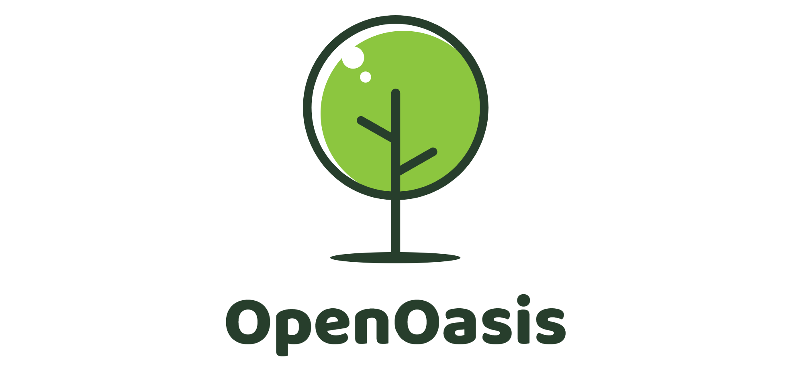

 

**OpenOasis，绿洲，一个物理世界机理模型的开放实验项目。**

---------------------------------------------------------------------------------

# 海马体深度学习框架

*Hippo(short for hippocampus) model*  

基于 [PyNet](https://github.com/Kaslanarian/PyNet) 、[MatrixSlow](https://github.com/zc911/MatrixSlow)、[tinynn](https://github.com/borgwang/tinynn) 等项目实现的一套简单可用的深度学习框架，主要用于学习和理解深度学习技术。  
后期考虑基于该框架，继续集成强化强化学习引擎（依然是简单实现）。

---------------------------------------------------------------------------------

