

---------------------------------------------------------------------------------

# 纳维-斯托克斯模型

*Navier-Stokes Model*  

**流场理论**，将流体运动看作是充满一定空间而由无数流体质点组成的连续介质运动。其中，  
运动流体所占据的空间，叫做 **流场**。  

不同时刻，流场中不同位置的流体质点有各自的流速、加速度、压强、密度，  
研究流体运动规律就是求解流场中这些运动要素的变化情况。  

分析方法是在流场中任意取出一个**微分平行六面体**进行研究，应用机械运动的一般原理，  
获得表达流体运动规律的微分方程。  
在该方法中，将流体运动看作是三维流动，各项运动要素均是空间坐标 (x, y, z) 的函数。  

*流体质点存在无限多个，要如何去描述整个流体的运动规律？*  

**欧拉法**，通过观察不同流体质点通过**固定**空间点的运动情况来了解整个流场的流动情况，  
即着眼于研究各种运动要素的 **分布场**。  
采用欧拉法，把流场中运动要素 $f$ 表示为空间和时间的函数：$ f = f(x, y, z, t) $。  

采用欧拉法，将目光聚焦在空间内水流动情况，分析对象是空间点处运动要素变化情况，    
而非追究具体的流体质点的运动轨迹。    

+ [流体运动的基本要素](#流体运动的基本要素)：流速场、时变加速度和位变加速度等。
+ [流线和迹线](#流线和迹线)：流线和迹线的方程。
+ [流体运动的基本形式](#质点运动的基本形式)：质点的平移、线应变、角应变、旋转。
+ [涡流和势流](#涡流和势流)：涡流和涡流场，势流和势函数。
+ [连续性方程](#流体运动的连续性方程)
+ [理想流体的运动方程](#理想流体的运动方程)：理想流体运动方程（欧拉方程）、葛罗米柯方程及力函数。
+ [理想流体的能量方程](#理想流体的能量方程)：理想流体的恒定流能量方程  
（伯努利方程）、非恒定有涡能量方程（拉格朗日方程）、非恒定无涡能量方程。
+ [实际流体的运动方程](#实际流体的运动方程)：实际流体的内摩擦定律，  
本构方程，纳维 - 斯托克斯方程，湍流以及雷诺时均方程，边界层以及相关方程。
+ [实际流体的能量方程](#实际流体的能量方程)：实际流体不可压缩能量方程，输运方程，傅里叶定律等等。

---------------------------------------------------------------------------------

## 流体运动的基本要素

*The Basic Elements of Fluid Motion*

一般情况下，同一时刻不同空间点 $(x, y, z)$ 上流体的运动要素是不同的；即使在同一点上，  
流速、加速度、密度和压强，各项运动要素也是随时间 $t$ 变化的。  
不同时刻质点在不同空间点的 **流速** 在各方向的投影：  

$$\begin{cases}
u_x = f_x(x, y, z, t) \\
u_y = f_y(x, y, z, t) \\
u_z = f_z(x, y, z, t) \\
\end{cases} \tag{1-1}$$

1. 若令 $x,y,z$ 为常数，$t$ 为变数，得到不同时刻同一空间点处流体质点的流速变化情况；
2. 若令 $t$ 为常数，$x,y,z$ 为变数，得到同一瞬间流场内不同空间点上质点流速分布情况。

其中，情况 $2$ 即 **流速场**，一般的：
+ 同一空间点上不同质点通过时的速度是不同的，即流速随时间变化；
+ 同一瞬间下不同空间点的流速也是不同的，即流速随空间位置变化。

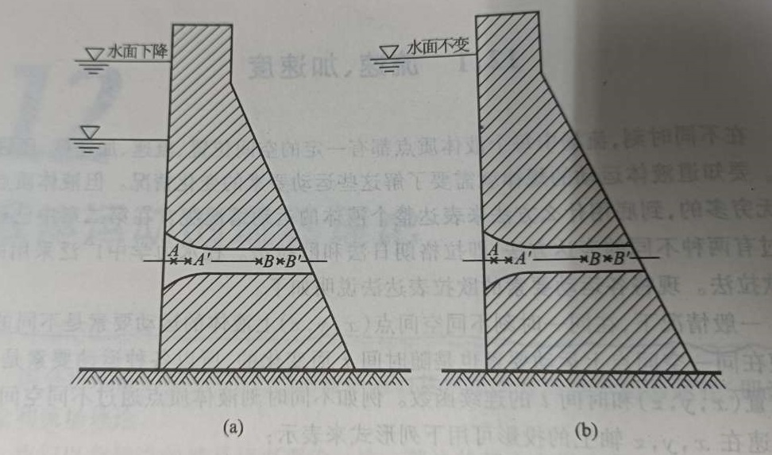

时刻 $t$，流场中 $ A, A' $ 点 $x$ 方向投影流速分别为：  

$$ u_x \quad and \quad u_x + \frac{\partial u_x}{\partial x}\mathrm{d}x  \tag{1-2}$$

时刻 $t+dt$，流场中 $ A, A' $ 点 $x$ 方向流速各为： 

$$ u_x + \frac{\partial u_x}{\partial t}\mathrm{d}t \quad and \quad  (u_x + \frac{\partial u_x}{\partial x}\mathrm{d}x) + \frac{\partial }{\partial t}(u_x + \frac{\partial u_x}{\partial x}\mathrm{d}x)\mathrm{d}t \tag{1-3}$$    

假设一个流体质点在时刻 $t$ 从空间点 $A$ 经过时间 $dt$ 后运动到$A'$，**加速度为$a_x$**，则有：  

$$a_x = \frac{(u_x + \frac{\partial u_x}{\partial x}\mathrm{d}x + \frac{\partial u_x}{\partial t}\mathrm{d}t) - u_x}{\mathrm{d}t} = \frac{\partial u_x}{\partial t} + u_x\frac{\partial u_x}{\partial x}\tag{1-4}$$

 
分析流体质点的加速度，其中由两个部分构成：

1. $ \frac{\partial u_x}{\partial t} $，即空间定点上流体质点流速随时间的变化，称为 **时变加速度**，又称 **当地加速度**；
2. $ u_x\frac{\partial u_x}{\partial x} $，即同一时刻下流体质点流速随位置变化，称为 **位变加速度**，又称 **位移加速度**。

在上面的例子中，因为流体质点的运动轨迹与 $x$ 轴重合，所以 $dx = dy = 0$，则有：  

$$\frac{\partial u_x}{\partial y}\mathrm{d}y = 0 \quad and \quad \frac{\partial u_x}{\partial z}\mathrm{d}z = 0 \tag{1-5}$$

一般情况下，质点 **加速度** 在各方向的投影：  

$$\begin{cases}
a_x = \frac{\mathrm{d}u_x}{\mathrm{d}t} = \frac{\partial u_x}{\partial t} + \frac{\partial u_x}{\partial x}\frac{\mathrm{d}x}{\mathrm{d}t} + \frac{\partial u_x}{\partial y}\frac{\mathrm{d}y}{\mathrm{d}t} + \frac{\partial u_x}{\partial z}\frac{\mathrm{d}z}{\mathrm{d}t}\\
  \\
a_y = \frac{\mathrm{d}u_y}{\mathrm{d}t} = \frac{\partial u_y}{\partial t} + \frac{\partial u_y}{\partial x}\frac{\mathrm{d}x}{\mathrm{d}t} + \frac{\partial u_y}{\partial y}\frac{\mathrm{d}y}{\mathrm{d}t} + \frac{\partial u_y}{\partial z}\frac{\mathrm{d}z}{\mathrm{d}t}\\
  \\
a_z = \frac{\mathrm{d}u_z}{\mathrm{d}t} = \frac{\partial u_z}{\partial t} + \frac{\partial u_z}{\partial x}\frac{\mathrm{d}x}{\mathrm{d}t} + \frac{\partial u_z}{\partial y}\frac{\mathrm{d}y}{\mathrm{d}t} + \frac{\partial u_z}{\partial z}\frac{\mathrm{d}z}{\mathrm{d}t}\\
\end{cases} \tag{1-6}$$

因为 $ u_x = \frac{\mathrm{d}x}{\mathrm{d}t}, u_y = \frac{\mathrm{d}y}{\mathrm{d}t}, u_z = \frac{\mathrm{d}z}{\mathrm{d}t} $，代入上式，得流体 **速度** 在流速场内的变化率：

$$\frac{\mathrm{d}u}{\mathrm{d}t} = \frac{\partial u}{\partial t} + u_x\frac{\partial u}{\partial x} + u_y\frac{\partial u}{\partial y} + u_z\frac{\partial u}{\partial z} \tag{1-7}$$

同样的推理过程，可以得到流体 **密度** 在流场内的变化率：  

$$\frac{\mathrm{d}\rho}{\mathrm{d}t} = \frac{\partial \rho}{\partial t} + u_x\frac{\partial \rho}{\partial x} + u_y\frac{\partial \rho}{\partial y} + u_z\frac{\partial \rho}{\partial z} \tag{1-8}$$

同样的推理过程，可以得到流体 **压强** 在流场内的变化率：  

$$\frac{\mathrm{d}p}{\mathrm{d}t} = \frac{\partial p}{\partial t} + u_x\frac{\partial p}{\partial x} + u_y\frac{\partial p}{\partial y} + u_z\frac{\partial p}{\partial z} \tag{1-9}$$

[<i class="fa fa-home"></i>](#纳维-斯托克斯方程组)

*--- 补充：---*

1. 推导过程中忽略了高阶微量（二阶及以上），这种处理的依据：  
方程是建立在无限小的微分六面体上的，略去的高阶项相比未被略去的项无限小，  
采用微分方程描述这个系统时，绝对误差和相对误差都趋于 $0$；  
但若进行离散化数值求解，因为离散网格不是无限小的，  
此时被略去的高阶项相较之下就不是无穷小而是有限值，从而就会产生截断误差。

2. 特别的，对于恒定流（流场任意点处运动要素不随时间变化）， 

   必然满足：$\begin{cases}
\frac{\partial u_x}{\partial t} = \frac{\partial u_y}{\partial t} = \frac{\partial u_z}{\partial t} = 0 \\
\frac{\partial \rho}{\partial t} = 0 \\
\frac{\partial p}{\partial t} = 0 \\
\end{cases}$, 故运动要素仅为空间的函数：$\begin{cases}
u_x = f_x(x, y, z) \\
u_y = f_y(x, y, z) \\
u_z = f_z(x, y, z) \\
\end{cases}$

3. 特别的，对于均匀流（流场任意点处运动要素相同），  
必然满足：$\begin{cases}
\frac{\partial u_x}{\partial x} = \frac{\partial u_x}{\partial y} = \frac{\partial u_x}{\partial z} = 0 \\
... \\
\frac{\partial \rho}{\partial x} = \frac{\partial \rho}{\partial y} = \frac{\partial \rho}{\partial z} = 0 \\
\frac{\partial p}{\partial x} = \frac{\partial p}{\partial y} = \frac{\partial p}{\partial z} = 0 \\
\end{cases}$, 故运动要素仅为时间的函数：$\begin{cases}
u_x = f_x(t) \\
u_y = f_y(t) \\
u_z = f_z(t) \\
\end{cases}$

4. 恒定流中，时变加速度为 $0$；均匀流中，位变加速度为 $0$。   

---------------------------------------------------------------------------------

## 流线和迹线

*StreamLine & PathLine*

**拉格朗日法**，主要研究流体中各质点在不同时刻下运动要素的变化情况，从而引出迹线的概念；  
**欧拉法**，主要研究流场内同一时刻下不同质点的运动变化情况，从而引出流线的概念。  

**流线**，为某时刻下流速场内一条几何曲线，在该曲线上每个流体质点的速度向量与该曲线相切。  

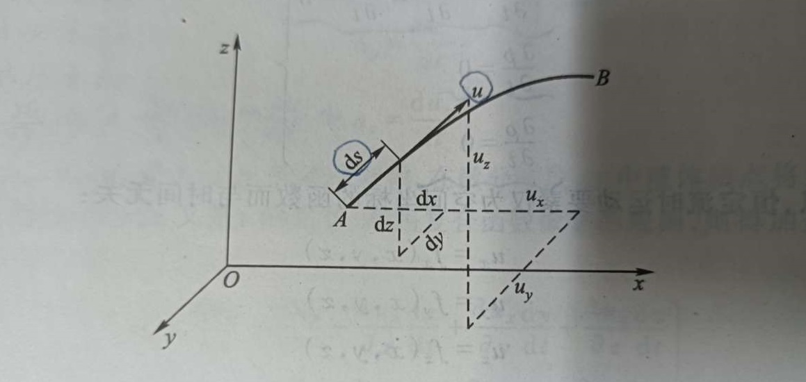

如图所示，在流线 $AB$ 上取一微分段 $ds$，因其无限小，可以看作直线。由流线的定义可知，  
$A$ 点处的流速向量 $u$ 与此流线微分段相切。  
现分别以 $u_x、u_y、u_z 和 d_x、d_y、d_z$ 表示流速向量 $u$ 和微分段 $ds$ 在各坐标轴上的投影。  
从而存在有关系，  

$$\cos{\alpha} = \frac{\mathrm{d}x}{\mathrm{d}s} = \frac{u_x}{u}, \quad
\cos{\beta}  = \frac{\mathrm{d}y}{\mathrm{d}s} = \frac{u_y}{u}, \quad
\cos{\gamma} = \frac{\mathrm{d}z}{\mathrm{d}s} = \frac{u_z}{u} 
 \tag{2-1}$$

**流线的微分方程**：

$$ \frac{dx}{u_x} = \frac{dy}{u_y} = \frac{dz}{u_z} = \frac{ds}{u} \tag{2-2}$$

其中，$ u_x、u_y、u_z $ 都是 $x, y, z, t$ 的函数；  
求取流速场内某时刻 $t$ 下流线时，把 $t$ 作为常数代入方程，积分即可。  

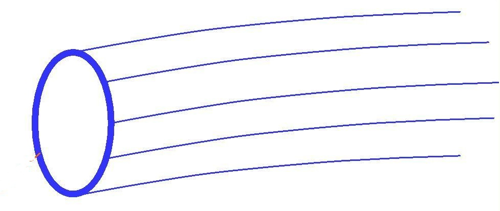

**流束**，流场中任取一个微小面积，通过面上各点作出的一束流线群；**流管**，流束空间的表面积。  
**迹线**，流体流动时其中某一流体质点在不同时刻下流动经历的路线。  

若将微分段 $ds$ 看作流体质点在时间 $dt$ 内的位移，$dx、dy、dz$ 表示位移  $ds$ 在各轴上投影。  
由迹线的定义有：  

$$\mathrm{d}x = u_x\mathrm{d}t, \quad
\mathrm{d}y = u_y\mathrm{d}t, \quad
\mathrm{d}z = u_z\mathrm{d}t 
\tag{2-3}$$

**迹线的微分方程**：  

$$ \frac{\mathrm{d}x}{u_x} = \frac{\mathrm{d}y}{u_y} = \frac{\mathrm{d}z}{u_z} = \mathrm{d}t \tag{2-4}$$

其中，流速 $ u_x, u_y, u_z $ 都是 $x, y, z, t$ 的函数；时间 $t$ 是自变量，坐标 $x, y, z$ 均是 $t$ 的函数。  

[<i class="fa fa-home"></i>](#纳维-斯托克斯方程组)

*--- 补充：---*

1. 流线是流场的一个瞬时快照；迹线是不同时刻质点位置集合。  
质点运动各时刻下、某位置上，迹线与流速相切；但若回顾，此处流速已经改变、不再相切。  

2. 恒定流中，迹线与流线重合。  

---------------------------------------------------------------------------------

## 质点运动的基本形式

*The Basic Performance of Particle Motion*

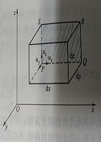
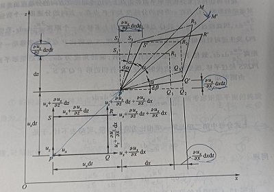

流体中任取某微分平行六面体，边长 $dx, dy, dz$；角点 $P(x, y, z)$ 处速度矢量 $u(u_x, u_y, u_z)$；   
其它角点处速度可以通过 **泰勒级数** 表达。  
由于六面体各个角点速度不同，经过时间 $dt$之后，不仅其位置发生移动，其形状也将发生变化。  
组成六面体的每个面都将发生这种变化，因此可以取一个面来分析整个微分六面体的运动情况 。  

这里，选取 $x-z$ 平面上 $PQRS$ 作分析对象： 

$$\begin{cases}
点P, (u_x, u_y, u_z) \\
  \\
点Q, (u_x + \frac{\partial u_x}{\partial x}\mathrm{d}x, u_y + \frac{\partial u_y}{\partial x}\mathrm{d}x, u_z + \frac{\partial u_z}{\partial x}\mathrm{d}x) \\
  \\
点S, (u_x + \frac{\partial u_x}{\partial z}\mathrm{d}z, u_y + \frac{\partial u_y}{\partial z}\mathrm{d}z, u_z + \frac{\partial u_z}{\partial z}\mathrm{d}z) \\
  \\
点R, (u_x + \frac{\partial u_x}{\partial x}\mathrm{d}x + \frac{\partial u_x}{\partial z}\mathrm{d}z, u_y + \frac{\partial u_y}{\partial x}\mathrm{d}x + \frac{\partial u_y}{\partial z}\mathrm{d}z, u_z + \frac{\partial u_z}{\partial x}\mathrm{d}x + \frac{\partial u_z}{\partial z}\mathrm{d}z) \\
\end{cases} \tag{3-1}$$

**位置平移**，分析面 PQRS 各角点速度，$u_x, u_z$ 是共有的组成部分；暂不考虑角点 Q,R,S 分速度  
与 P 的差异，则面 PQRS 将沿 x 轴移动 $u_x dt$、沿 y 轴移动 $u_y dt$，到达面 $P' Q_1 R_1 S_1$ 位置。  
在此过程中，面 PQRS 位置发生移动，但是其形状大小均未发生变化。  
由此推论，$u_x, u_y, u_z$ 是整个微分平行六面体在 x, y, z 轴的 **位移速度**。  

**线变形**，分析面 PQRS 各角点速度，点 R 对 S、点 Q 对 P 在 x 方向有相同的速度差 $ \frac{\partial u_x}{\partial x}\mathrm{d}x $，  
经过时间 $dt$之后，边线 SR、PQ 在 x 方向的变形均为$ \frac{\partial u_x}{\partial x}\mathrm{d}x\mathrm{d}t $；同理，边 PS、QR 在 z 向的   
变形均为 $ \frac{\partial u_z}{\partial z}\mathrm{d}z\mathrm{d}t $。面 PQRS 经过时间 $dt$、经过平移和边线变形后，变成矩形$P'Q_2R_2S_2$。  
各坐标轴方向每秒边单位长度的变形称为 **线变形速率**，又称 **线应变** 。  
所以，微分平行六面体在各坐标轴方向的线变形速率（线应变）即为： 

$$
x 方向,  \frac{\frac{\partial u_x}{\partial x}\mathrm{d}x\mathrm{d}t}{\mathrm{d}x\mathrm{d}t} = \frac{\partial u_x}{\partial x}; \quad
y 方向,  \frac{\frac{\partial u_y}{\partial y}\mathrm{d}y\mathrm{d}t}{\mathrm{d}y\mathrm{d}t} = \frac{\partial u_y}{\partial y}; \quad
z 方向,  \frac{\frac{\partial u_z}{\partial z}\mathrm{d}z\mathrm{d}t}{\mathrm{d}z\mathrm{d}t} = \frac{\partial u_z}{\partial z} 
\tag{3-2}$$

分析矩形平面各角点与边线垂直方向上的分速度差异对运动的影响 :    

+ 沿 z 方向，边 PQ 上角点 Q 与 P 的分速度差 $ \frac{\partial u_z}{\partial x}\mathrm{d}x $，经时间 $dt$，点 Q 比 P 多走 $ \frac{\partial u_z}{\partial x}\mathrm{d}x\mathrm{d}t $；

+ 沿 x 方向，边 PS 上角点 S 与 P 的分速度差 $ \frac{\partial u_x}{\partial z}\mathrm{d}z $ ，经时间 $dt$，点 S 比 P 多走 $ \frac{\partial u_x}{\partial z}\mathrm{d}z\mathrm{d}t $ ；  

前者使边线 PQ 逆时针偏转角度 $ \mathrm{d}\beta $，后者使边线 PS 顺时针偏转角度 $ \mathrm{d}\alpha $；  
最后，经过平移、线变形、边线偏转，微分矩形平面 PQRS 转变为平行四边形 $P'Q'R'S'$：  
$$\begin{cases}
\mathrm{d}\alpha \approx \tan(\alpha) = \frac{\frac{\partial u_x}{\partial z}\mathrm{d}z\mathrm{d}t}{\mathrm{d}z + \frac{\partial u_z}{\partial z}\mathrm{d}z\mathrm{d}t} \quad \Rightarrow \mathrm{d}\alpha = \frac{\partial u_x}{\partial z}\mathrm{d}t \\
  \\
\mathrm{d}\beta \approx \tan(\beta) = \frac{\frac{\partial u_z}{\partial x}\mathrm{d}x\mathrm{d}t}{\mathrm{d}x + \frac{\partial u_x}{\partial x}\mathrm{d}x\mathrm{d}t} \quad \Rightarrow \mathrm{d}\beta = \frac{\partial u_z}{\partial x}\mathrm{d}t \\
\end{cases} \tag{3-3}$$

因边线偏转导致的矩形平面 $P'Q_2R_2S_2$ 的变形过程，可以分解为两部分：角变形和旋转。  

**角变形**，边 $P'Q_2$ 首先逆时针偏转角度 $ \mathrm{d}\alpha - \gamma $，边 $P'S_2$ 同时顺时针偏转角度 $ \mathrm{d}\beta + \gamma $，  
两个偏转角度相等。矩形平面$P'Q_2R_2S_2$ 变形为四边形$P'Q_3R_3S_3$，二者等分角线重合，  
所以矩形平面 $P'Q_2R_2S_2$ 此时只有直角纯变形。由于角变形中两条边线的偏转角度相等： 

$$ \mathrm{d}\alpha - \gamma = \mathrm{d}\beta + \gamma \quad \Rightarrow \quad \gamma = \frac{\mathrm{d}\alpha - \mathrm{d}\beta}{2} \tag{3-4}$$  

绕各坐标轴方向每秒直角边线的角度变形称为 **角变形速率**，又称 **角应变**：

$$ \theta_y = \frac{\mathrm{d}\alpha - \gamma}{\mathrm{d}t} = \frac{1}{2}(\frac{\mathrm{d}\alpha + \mathrm{d}\beta}{\mathrm{d}t}) = \frac{1}{2}(\frac{\partial u_x}{\partial z} + \frac{\partial u_z}{\partial x}) \tag{3-5}$$

由此推论，微分六面体的角变形速率：  

$$
\theta_x = \frac{1}{2}(\frac{\partial u_y}{\partial z} + \frac{\partial u_z}{\partial y}) \qquad \quad 
\theta_z = \frac{1}{2}(\frac{\partial u_x}{\partial y} + \frac{\partial u_y}{\partial x}) 
\tag{3-6}$$

**旋转**，四边形 $P'Q_3R_3S_3$ 绕过点$P'$的 y 向的轴、顺时针旋转角度 $ \gamma $ 变成 $P'Q'R'S'$。  
( 边偏转角度 $ \mathrm{d}\alpha, \mathrm{d}\beta $ 不等导致旋转。$P'Q_3R_3S_3$ 等分角线 $P'M$ 旋转 $ \gamma $ 到达 $P'M'$。) 

绕各坐标轴方向每秒平面的纯旋转角称为 **旋转角速度**： 

$$ \omega_y = \frac{\gamma}{\mathrm{d}t} = \frac{1}{2}(\frac{\mathrm{d}\alpha - \mathrm{d}\beta}{2}) = \frac{1}{2}(\frac{\partial u_x}{\partial z} - \frac{\partial u_z}{\partial x}) \tag{3-7}$$

推论微分六面体各方向的旋转角速度：  
$$
\omega_x = \frac{1}{2}(\frac{\partial u_z}{\partial y} - \frac{\partial u_y}{\partial z}) \quad
\omega_z = \frac{1}{2}(\frac{\partial u_y}{\partial x} - \frac{\partial u_x}{\partial y}) 
\tag{3-8}$$

综上分析，微分平行六面体最普遍的运动均由平移、线应变、角应变、旋转四种组成；  
当微分六面体**无限缩小**，即质点，其运动基本形式也是平移、线应变、角应变、旋转。  

[<i class="fa fa-home"></i>](#纳维-斯托克斯方程组)

*--- 补充：---*

1. 分析微分平行六面体时，一般假设速度分量沿坐标轴正方向增大。

2. 推导偏转角度时，分母中忽略高阶项（二阶及以上）。

3. 记忆旋转角速度时，可以通过右手定则坐标系结合定义辅助记忆。

---------------------------------------------------------------------------------

## 涡流和势流

*Vortex Flow & Potential Flow*

**涡**，是指流体质点绕其自身轴旋转的运动；按照流体质点本身有无旋转，可将流体运动分为   
**有涡流** 和 **无涡流**。  
特别强调，涡与通常的旋转运动不同。  

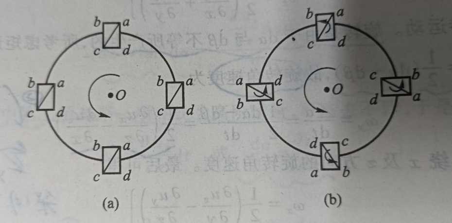

无涡流中，流体质点自旋角速度为 $0$：

$$\begin{cases}
\omega_x = \frac{1}{2}(\frac{\partial u_z}{\partial y} - \frac{\partial u_y}{\partial z}) = 0 \quad \Rightarrow  \quad \frac{\partial u_z}{\partial y} = \frac{\partial u_y}{\partial z} \\
  \\
\omega_y = \frac{1}{2}(\frac{\partial u_x}{\partial z} - \frac{\partial u_z}{\partial x}) = 0 \quad \Rightarrow \quad \frac{\partial u_x}{\partial z} = \frac{\partial u_z}{\partial x} \\
  \\
\omega_z = \frac{1}{2}(\frac{\partial u_y}{\partial x} - \frac{\partial u_x}{\partial y}) = 0 \quad \Rightarrow \quad \frac{\partial u_y}{\partial x} = \frac{\partial u_x}{\partial y} \\
\end{cases} \tag{4-1}$$

**势函数**，对某一标量函数 $ \varphi $ 求梯度，得到矢量 $ \upsilon $，则称 $ \varphi $ 为 $ \upsilon $ 的势函数。  
势函数是某些矢量场上关于空间位置处势能的函数，是对场中能量的刻画。  
例如重力场，  
重力势函数 $mg*z$ 在 $x,y,z$ 方向上偏导就是重力势能在不同方向上的变化速度，即重力。   

流速场中的流速势函数在 $x,y,z$ 方向上的偏导就是流速势在不同方向的变化速度，即流速。 
若存在流场势函数 $\varphi$，则有：  

$$
\textbf{x 方向}, u_x = \frac{\partial \varphi}{\partial x}; \qquad 
\textbf{y 方向}, u_y = \frac{\partial \varphi}{\partial y}; \qquad
\textbf{z 方向}, u_z = \frac{\partial \varphi}{\partial z} \tag{4-2}
$$

若沿着方向继续求导，则有：  

$$\begin{aligned}
\frac{\partial^2 \varphi}{\partial x \partial y} = \frac{\partial u_x}{\partial y} = \frac{\partial u_y}{\partial x} \\
\frac{\partial^2 \varphi}{\partial x \partial z} = \frac{\partial u_x}{\partial z} = \frac{\partial u_z}{\partial x} \\
\frac{\partial^2 \varphi}{\partial z \partial y} = \frac{\partial u_z}{\partial y} = \frac{\partial u_y}{\partial z}  \end{aligned}   \tag{4-3}$$

由此可知，若流场中的流体是无涡流，则必然存在流速势函数。所以，无涡流又称**势流**： 

$$\begin{gathered}
\frac{\partial \varphi}{\partial x}\mathrm{d}x + \frac{\partial \varphi}{\partial y}\mathrm{d}y + \frac{\partial \varphi}{\partial z}\mathrm{d}z = u_x\mathrm{d}x + u_y\mathrm{d}y + u_z\mathrm{d}z \\
\mathrm{d}\varphi = u_x\mathrm{d}x + u_y\mathrm{d}y + u_z\mathrm{d}z \end{gathered} \tag{4-4}$$

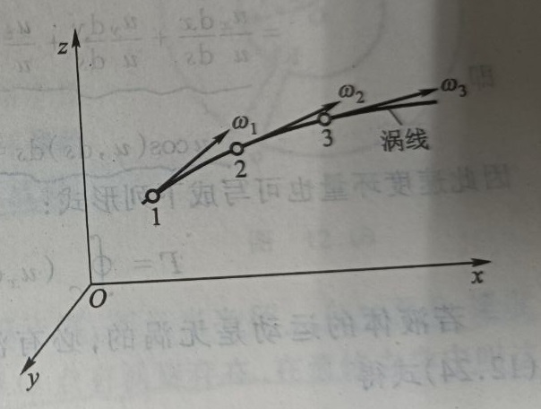

有涡流可用旋转角速度的矢量来表征，即**涡流场**；类似流速场，可以引入 涡线 和 涡束。  
**涡线**，瞬时涡量场中一条几何曲线，线上各点的旋转角速度都与该曲线相切。

$$ \frac{\mathrm{d}x}{\omega_x} = \frac{\mathrm{d}y}{\omega_y} = \frac{\mathrm{d}z}{\omega_z} \tag{4-5}$$

类似于流速场中的流线，涡线之间不会相交；恒定流下，涡线形状保持不变。  

**涡束**，类似流束，涡流场中任取一个微小面积，通过面上各点作出一束涡线空间即是 。  
在微小涡束断面上各点的旋转角速度可以认为是相等的。  
**涡旋通量**，类似流量，是微小涡束的横断面面积与旋转角速度之积，又称为 **涡旋强度**。  

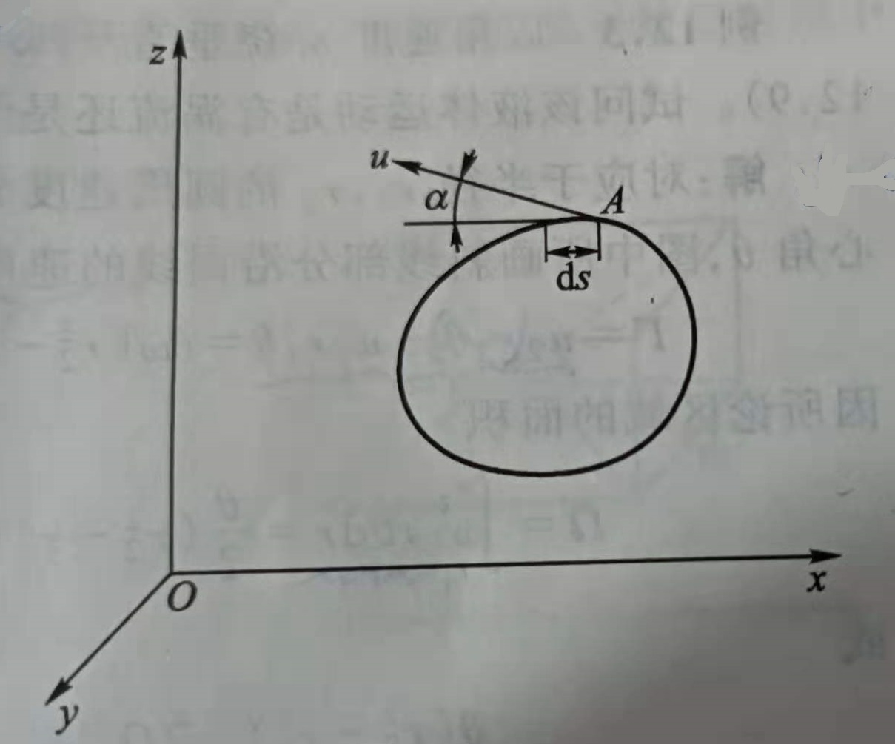

流场中取任意的封闭周线，将流速矢量沿周线的积分称为 **速度环量** ，表示涡旋强度。  
封闭周线 $C$ 上取微小弧段$Δs$，弧段上流速 $u$ 与左手定则绕行下的切线的夹角为 $α$：   

$$ \Gamma = lim \sum {u\cos(\alpha)\Delta s} = \oint_{C} u\cos(\alpha)\mathrm{d}s = \oint_{C} u\cos(u, \mathrm{d}s)\mathrm{d}s \tag{4-6}$$

$\Gamma$ 即为沿封闭周线 C 的速度环量；若周线上的切向速度与绕行方向相同，则$\Gamma$ 为正。  
根据解析几何，两直线夹角的余弦等于两直线方向余弦的对应乘积之和：  

$$\begin{aligned}
cos(\alpha) &= \cos(u, \mathrm{d}s) \\
&= \cos(u,x)\cos(\mathrm{d}s,x) + \cos(u,y)\cos(\mathrm{d}s,y) + \cos(u,z)\cos(\mathrm{d}s,z) \\
&= \frac{u_x}{u}\frac{\mathrm{d}x}{\mathrm{d}s} + \frac{u_y}{u}\frac{\mathrm{d}y}{\mathrm{d}s} + \frac{u_z}{u}\frac{\mathrm{d}z}{\mathrm{d}s}\\
\therefore  \\
&\Rightarrow u\cos(\alpha)\mathrm{d}s = u_x\mathrm{d}x + u_y\mathrm{d}y + u_z\mathrm{d}z \\
&\Rightarrow \Gamma = \oint_{c} (u_x\mathrm{d}x + u_y\mathrm{d}y + u_z\mathrm{d}z)
\end{aligned} \tag{4-7}$$

结合以上分析，如果流体运动是无涡流，必然存在相应的流速势函数，所以存在：  
$$ \Gamma = \oint_{c} \mathrm{d}\varphi = [\varphi]_{A}^{A} = 0 \tag{4-8}$$

由此得出结论，无涡流场中的任意封闭周线的速度环量都是 $0$，即涡旋强度为 $0$ 。  

[<i class="fa fa-home"></i>](#纳维-斯托克斯方程组)

*--- 补充：---*

1. 环线积分中绕行方向遵循左手定则，即绕行过程中保持左手位于环内。

2. 曲线积分中，直角坐标系与极坐标系的转换（注意积分区间的转换）($\mathrm{d}s = \mathrm{d}\theta * r$)： 

$$
\int_{L} O(x,y,z)\mathrm{d}x + P(x,y,z)\mathrm{d}y + Q(x,y,z)\mathrm{d}z \\
= \int_{L} O\cos\alpha \mathrm{d}s + P\cos\beta\mathrm{d}s + Q\cos\gamma\mathrm{d}s  
= \int_{L} (O\cos\alpha + P\cos\beta + Q\cos\gamma) \mathrm{d}s \\
$$  

---------------------------------------------------------------------------------

## 流体运动的连续性方程

*The Continuity Equation of Fluid Motion*

连续介质流体，在流场中任选一个封闭空间，在某一给定时间段中流入封闭空间的流体质量  
与流出的流体质量之差应该等于该封闭空间内因密度变化引起的流体质量变化。  
如果流体是不可压缩的均质流体，则封闭空间流进与流出的流体质量应该相等。  
以上质量守恒关系以数学分析表达成微分方程，即称为**流体运动的连续性方程**。  

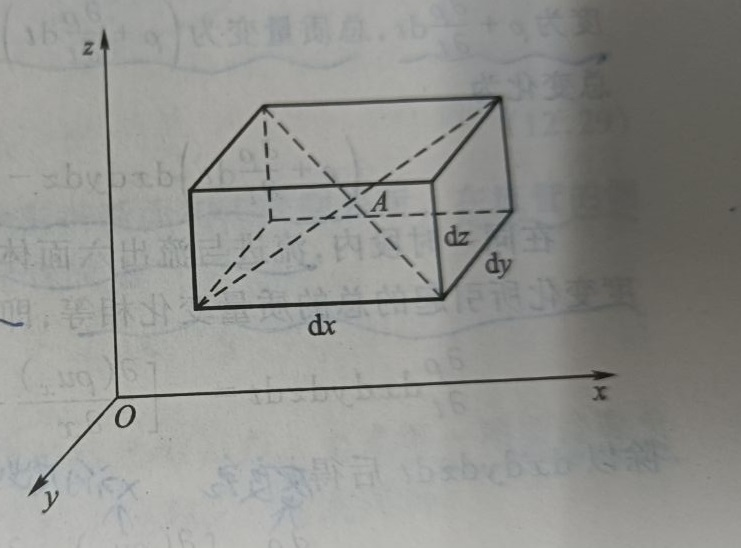

流场中微分平行六面体边长 $dx, dy, dz$，形心 $A(x,y,z)$ 速度 $u(u_x,u_y,u_z)$、密度 $ρ$。  
经微小时段 $dt$，  

+ 自左面流入的流体质量：$q_{i} = (\rho - \frac{\partial \rho}{\partial x}\frac{\mathrm{d}x}{2})(u_x - \frac{\partial u_x}{\partial x}\frac{\mathrm{d}x}{2})\mathrm{d}y\mathrm{d}z\mathrm{d}t$；

+ 自右面流出的流体质量：$q_{o} = (\rho + \frac{\partial \rho}{\partial x}\frac{\mathrm{d}x}{2})(u_x + \frac{\partial u_x}{\partial x}\frac{\mathrm{d}x}{2})\mathrm{d}y\mathrm{d}z\mathrm{d}t$。

$dt$ 时段内，$x$ 方向流入与流出六面体的质量差：  

$$\Delta m_x = q_i - q_o = - (u_x \frac{\partial \rho}{\partial x} + \rho \frac{\partial u_x}{\partial x})\mathrm{d}x\mathrm{d}y\mathrm{d}z\mathrm{d}t = - \frac{\partial \rho u_x}{\partial x}\mathrm{d}x\mathrm{d}y\mathrm{d}z\mathrm{d}t \tag{5-1}$$

同理，在 $y,z$ 方向流入与流出六面体的质量差： 

$$\begin{gathered}
\Delta m_y = - \frac{\partial \rho u_y}{\partial y}\mathrm{d}x\mathrm{d}y\mathrm{d}z\mathrm{d}t \\ 
\Delta m_z = - \frac{\partial \rho u_z}{\partial z}\mathrm{d}x\mathrm{d}y\mathrm{d}z\mathrm{d}t
\end{gathered} \tag{5-2}$$

$dt$ 时段内，六面体内流体密度由 $\rho$ 变为 $\rho + \frac{\partial \rho}{\partial t}$，引起的质量变化:  

$$\Delta m = \frac{\partial \rho}{\partial t}\mathrm{d}x\mathrm{d}y\mathrm{d}z\mathrm{d}t \tag{5-3}$$

$dt$ 时段内，微分平行六面体内流体的质量守恒（介质连续）原理：  

$$\begin{gathered}
\Delta m = \Delta m_x + \Delta m_y + \Delta m_z \\
\frac{\partial \rho}{\partial t}\mathrm{d}x\mathrm{d}y\mathrm{d}z\mathrm{d}t = - [\frac{\partial \rho u_x}{\partial x} + \frac{\partial \rho u_y}{\partial y} + \frac{\partial \rho u_z}{\partial z}]\mathrm{d}x\mathrm{d}y\mathrm{d}z\mathrm{d}t \\
\end{gathered} \tag{5-4}$$

除以 $\mathrm{d}x\mathrm{d}y\mathrm{d}z\mathrm{d}t$ 之后得到，**可压缩流体非恒定流的连续性方程** ：  
$$\frac{\partial \rho}{\partial t} + [\frac{\partial \rho u_x}{\partial x} + \frac{\partial \rho u_y}{\partial y} + \frac{\partial \rho u_z}{\partial z}] = 0 \tag{5-5}$$

*------------------ * ------------------*

对不可压缩流体，$ρ$为常数、与空间时间无关，连续性方程简化：  

$$\frac{\partial u_x}{\partial x} + \frac{\partial u_y}{\partial y} + \frac{\partial u_z}{\partial z} = 0  \quad  or \quad  \nabla \cdot \textbf{u} = 0 \tag{5-6}$$

由于 $\frac{\partial u_x}{\partial x}, \frac{\partial u_y}{\partial y},\frac{\partial u_z}{\partial z}$ 表示微分六面体沿 $x,y,z$ 方向的线变形速率，则六面体的体积变化：  
$$(\frac{\partial u_x}{\partial x} + \frac{\partial u_y}{\partial y} + \frac{\partial u_z}{\partial z} )\mathrm{d}x\mathrm{d}y\mathrm{d}z\mathrm{d}t \tag{5-7}$$

对于不可压缩流体，
微分平行六面体经平移和线变形后体积保存不变，同时角变形和旋转也不改变体积大小：  

$$\begin{aligned}
\iiint_{V} \mathrm{div}  \textbf{u}  \mathrm{d}V &= \iiint_{V} (\frac{\partial u_x}{\partial x} + \frac{\partial u_y}{\partial y} + \frac{\partial u_z}{\partial z} )\mathrm{d}x\mathrm{d}y\mathrm{d}z\mathrm{d}t \\
&= \iint_{S} u_n \mathrm{d}s \quad
= 0 \\
\end{aligned} \tag{5-8}$$

$S$ 是体积 $V$ 的表面积；$u_n$ 是 $S$ 上各点的法线方向的投影流速；$\iint_{S} u_n \mathrm{d}s$ 即速度通量。  

*------------------ * ------------------*

恒定流下的流管，由于流管侧表面上 $u_n = 0$，所以：  

$$\iint_{S} u_n \mathrm{d}s = - \iint_{A_i} u_i\mathrm{d}A_i + \iint_{A_o} u_o\mathrm{d}A_o = 0 \tag{5-9}$$

其中，$A_i,u_i$是流管流入横断面的面积、流速；$A_o,u_o$是流管流出横断面的面积、流速。  

$$\iint_{A_i} u_i\mathrm{d}A_i = \iint_{A_o} u_o\mathrm{d}A_o \quad \Rightarrow \quad
Q_i = Q_o \tag{5-10}$$

方程表明，恒定流时流管一端流量流入，对不可压缩流体，另一端定有相等的流量流出。  

[<i class="fa fa-home"></i>](#纳维-斯托克斯方程组)

*--- 补充：---*

1. 分析微分六面体内质量变化时，认为六面体空间是固定的、不变的。

2. 计算微分六面体中面上流量时，以形心流速作面上平均流速，即假设 $u_i$ 在面上线性分布。

3. $\mathrm{div} \space \textbf{u}$ 称为速度散度，结果为标量。

---------------------------------------------------------------------------------

## 理想流体的运动方程

*The Motion Equation of Ideal Fluid*

对于不可压缩、无粘性的 **理想流体**，其动水压强：
1. 总是沿作用面的内法线方向；因为 “无粘假设”，故流体内无切应力，作用面上仅有压应力。
2. 在理想流体中，任何点的动水压强在各个方向上的大小均相等（与静水压强相同）。

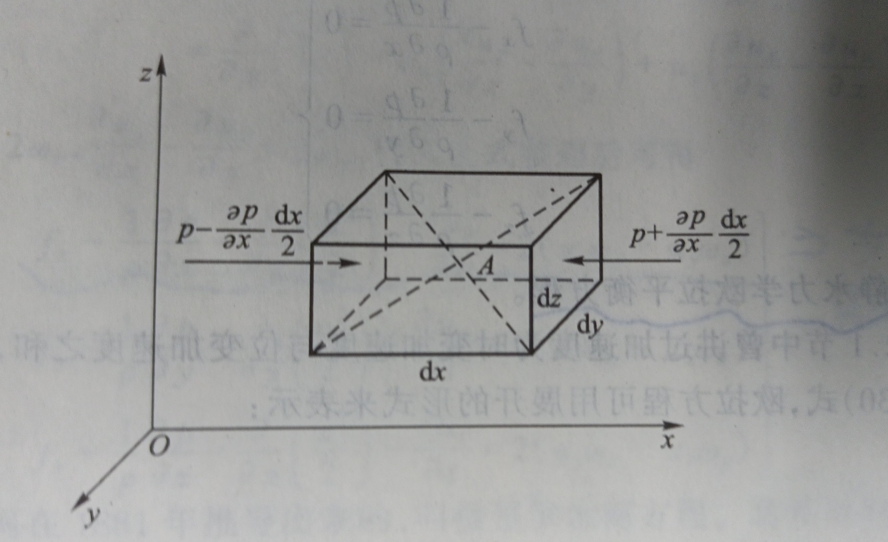

在理想流体流场中任意一点 $A(x, y, z)$ 处动水压强为 $p$，速度 $u_x, u_y, u_z$。以 $A$ 为中心任取  
一个微分平行六面体，其边长为 $dx, dy, dz$，分别平行于 $x, y, z$ 轴。同时，  
作用于六面体的仅表面力（动水压力）和质量力，单位质量力在各轴方向投影为 $f_x, f_y, f_z$。  

作用在六面体 $x$ 轴方向的表面上的平均动水压强:  

$$Left, p - \frac{\partial p}{\partial x} \frac{\mathrm{d}x}{2}; \quad  Right, p + \frac{\partial p}{\partial x} \frac{\mathrm{d}x}{2} \tag{6-1}$$

根据力学原理，则有：

$$\begin{gathered}
f_x\rho\mathrm{d}x\mathrm{d}y\mathrm{d}z + (p - \frac{\partial p}{\partial x})\mathrm{d}y\mathrm{d}z - (p + \frac{\partial p}{\partial x})\mathrm{d}y\mathrm{d}z = \rho\mathrm{d}x\mathrm{d}y\mathrm{d}z\frac{\mathrm{d}u_x}{\mathrm{d}t} \\
\Rightarrow f_x - \frac{1}{\rho}\frac{\partial p}{\partial x} = \frac{\mathrm{d}u_x}{\mathrm{d}t} \\
\end{gathered} \tag{6-2}$$

由此推论，六面体在各方向均有类似的关系，得到 **理想流体的运动方程**，又称 **欧拉方程**：  

$$\begin{cases}
f_x - \frac{1}{\rho}\frac{\partial p}{\partial x} = \frac{\mathrm{d}u_x}{\mathrm{d}t} \\
  \\
f_y - \frac{1}{\rho}\frac{\partial p}{\partial y} = \frac{\mathrm{d}u_y}{\mathrm{d}t} \\
  \\
f_z - \frac{1}{\rho}\frac{\partial p}{\partial z} = \frac{\mathrm{d}u_z}{\mathrm{d}t} \\
\end{cases} \tag{6-3}$$

方程适用于不可压缩流体或可压缩气体。对于前者，密度 $ρ$是常数；对于后者，$ρ$为变量。

*------------------ * ------------------*

对于静止流体$u_x = u_y = u_z$，由此得到 **静水力学欧拉平衡方程**：

$$\begin{cases}
f_x - \frac{1}{\rho}\frac{\partial p}{\partial x} = 0 \\
  \\
f_y - \frac{1}{\rho}\frac{\partial p}{\partial y} = 0 \\
  \\
f_z - \frac{1}{\rho}\frac{\partial p}{\partial z} = 0 \\
\end{cases} \tag{6-4}$$

因为在流场中，加速度由时变加速度和位变加速度两部分而组成：   

$$a_i = \frac{\mathrm{d}u_i}{\mathrm{d}t} = \frac{\partial u_i}{\partial t} + \frac{\partial u_i}{\partial x}\frac{\mathrm{d}x}{\mathrm{d}t} + \frac{\partial u_i}{\partial y}\frac{\mathrm{d}y}{\mathrm{d}t} + \frac{\partial u_i}{\partial z}\frac{\mathrm{d}z}{\mathrm{d}t} \tag{6-5}$$

则欧拉方程简化为：  

$$\begin{cases}
f_x - \frac{1}{\rho}\frac{\partial p}{\partial x} = \frac{\partial u_x}{\partial t} + u_x\frac{\partial u_x}{\partial x} + u_y\frac{\partial u_x}{\partial y} + u_z\frac{\partial u_x}{\partial z} \\
  \\
f_y - \frac{1}{\rho}\frac{\partial p}{\partial y} = \frac{\partial u_y}{\partial t} + u_x\frac{\partial u_y}{\partial x} + u_y\frac{\partial u_y}{\partial y} + u_z\frac{\partial u_y}{\partial z} \\
  \\
f_z - \frac{1}{\rho}\frac{\partial p}{\partial z} = \frac{\partial u_z}{\partial t} + u_x\frac{\partial u_z}{\partial x} + u_y\frac{\partial u_z}{\partial y} + u_z\frac{\partial u_z}{\partial z} \\
\end{cases} \tag{6-6}$$

对于不可压缩理想流体$ρ$已知，单位质量力 $f_x, f_y, f_z$ 已知，未知数仅 为 $p, u_x, u_y, u_z$。  
联解欧拉方程和连续方程，理论上，理想流体中任意点、时刻的流速和动水压强均可求。  

*------------------ * ------------------*

将欧拉方程中速度项变形，可以得到：  

$$\begin{aligned}
& \sqrt{{u_x}^2 + {u_y}^2 + {u_z}^2} = u \\
\\
&\Rightarrow \frac{\partial}{\partial x}(\frac{u^2}{2}) = \frac{\partial}{\partial x}(\frac{{u_x}^2 + {u_y}^2 + {u_z}^2}{2}) = u_x\frac{\partial u_x}{\partial x} + u_y\frac{\partial u_y}{\partial x} + u_z\frac{\partial u_z}{\partial x} \\
\\
&\Rightarrow u_x\frac{\partial u_x}{\partial x} = \frac{\partial}{\partial x}(\frac{u^2}{2}) - u_y\frac{\partial u_y}{\partial x} - u_z\frac{\partial u_z}{\partial x}
\end{aligned} \tag{6-7}$$

将旋转角速度引入欧拉方程，可得到：

$$\begin{aligned}
f_x - \frac{1}{\rho}\frac{\partial p}{\partial x} - \frac{\partial u_x}{\partial t} &= \frac{\partial}{\partial x}(\frac{u^2}{2}) - u_y\frac{\partial u_y}{\partial x} - u_z\frac{\partial u_z}{\partial x} + u_y\frac{\partial u_x}{\partial y} + u_z\frac{\partial u_x}{\partial z} \\
&= \frac{\partial}{\partial x}(\frac{u^2}{2}) - u_y(\frac{\partial u_y}{\partial x} - \frac{\partial u_x}{\partial y}) + u_z(\frac{\partial u_x}{\partial z} - \frac{\partial u_z}{\partial x}) \\
&= \frac{\partial}{\partial x}(\frac{u^2}{2}) - u_y\cdot2\omega_z + u_z\cdot2\omega_y
\end{aligned} \tag{6-8}$$

整理之后可以得到，**葛罗米柯方程组**：  

$$\begin{cases}
f_x - \frac{1}{\rho}\frac{\partial p}{\partial x} - \frac{\partial u_x}{\partial t} - \frac{\partial}{\partial x}(\frac{u^2}{2}) = 2(u_z\omega_y - u_y\omega_z) \\
  \\
f_y - \frac{1}{\rho}\frac{\partial p}{\partial y} - \frac{\partial u_y}{\partial t} - \frac{\partial}{\partial y}(\frac{u^2}{2}) = 2(u_x\omega_z - u_z\omega_x) \\
  \\
f_z - \frac{1}{\rho}\frac{\partial p}{\partial z} - \frac{\partial u_z}{\partial t} - \frac{\partial}{\partial z}(\frac{u^2}{2}) = 2(u_y\omega_x - u_x\omega_y) \\
\end{cases} \tag{6-9}$$

若作用于流体上的质量力 $f_x, f_y, f_z$ 是有势的，则必然存在**力函数$U(x, y, z, t)$**，且有：  

$$f_x = \frac{\partial U}{\partial x}, \space f_y = \frac{\partial U}{\partial y}, \space f_z = \frac{\partial U}{\partial z} \tag{6-10}$$

对于理想流体，流体不可压缩，$ρ$为常数，得到质量力有势的情况下的葛罗米柯方程组：  
$$\begin{cases}
\frac{\partial}{\partial x}(U - \frac{p}{\rho} - \frac{u^2}{2}) - \frac{\partial u_x}{\partial t} = 2(u_z\omega_y - u_y\omega_z) \\
  \\
\frac{\partial}{\partial y}(U - \frac{p}{\rho} - \frac{u^2}{2}) - \frac{\partial u_y}{\partial t} = 2(u_x\omega_z - u_z\omega_x) \\
  \\
\frac{\partial}{\partial z}(U - \frac{p}{\rho} - \frac{u^2}{2}) - \frac{\partial u_z}{\partial t} = 2(u_y\omega_x - u_x\omega_y) \\
\end{cases} \tag{6-11}$$

适用理想流体恒定流和非恒定流，有涡流和无涡流；对无涡流，$\omega_x = \omega_y = \omega_z = 0$。

[<i class="fa fa-home"></i>](#纳维-斯托克斯方程组)

---------------------------------------------------------------------------------

## 理想流体的能量方程

*The Energy Equation of Ideal Fluid*

**热力学第一定律**，一个静止的热力学系统储能的增加等于外力对系统的做功与外界传入的热量之和。  

+ 外力做功：表面力做功 + 质量力做功；
+ 外界传热：外部传导热 + 外部辐射热；

一个流体微团可以看作一个热力学系统，同时流体质点总在流动中，  
假设系统偏离平衡态不远，则系统总能量的变化率等于外力的做功功率和外界的传热功率之和。  

对某一个流体微团，系统单位能量$e_s$包括：  

+ 系统内能 $e$，由流体分子热运动而具有的能量；
+ 系统动能 $\frac{v^2}{2}$；
+ 系统势能 $gz$；

热力学第一定律应用于流体流动，则上述热力学关系的微分方程，称为 **流体运动的能量方程**。  
理想流体因无粘性不可压缩，无内能损耗，其能量方程反应了外部做功与流体机械能的关系 。  

在理想流体流场中任意一点 $A(x, y, z)$ 处动水压强为 $p$，速度为 $u_x, u_y, u_z$。以点 $A$ 为中心  
取一微分平行六面体，其边长为 $dx, dy, dz$，分别平行于 $x, y, z$ 轴。同时，  
作用于六面体的仅表面力（动水压力）和质量力，单位质量力在各轴方向投影为 $f_x, f_y, f_z$。  

在$x$方向，平移速度为$u_x$，外力做功 $W_x$：   

$$\begin{aligned}
W_x &= (f_x\rho\mathrm{d}x\mathrm{d}y\mathrm{d}z + (p - \frac{\partial p}{\partial x})\mathrm{d}y\mathrm{d}z - (p + \frac{\partial p}{\partial x})\mathrm{d}y\mathrm{d}z)\cdot u_x\mathrm{d}t \\
&= (f_x - \frac{\partial p}{\partial x})\mathrm{d}x\mathrm{d}y\mathrm{d}z\cdot u_x\mathrm{d}t \\
\end{aligned} \tag{7-1}$$

由此推论，六面体各方向上所受外力做功：  

$$\begin{cases}
W_x = (f_x - \frac{\partial p}{\partial x})\mathrm{d}x\mathrm{d}y\mathrm{d}z\cdot u_x\mathrm{d}t \\
  \\
W_y = (f_y - \frac{\partial p}{\partial y})\mathrm{d}x\mathrm{d}y\mathrm{d}z\cdot u_y\mathrm{d}t \\
  \\
W_z = (f_z - \frac{\partial p}{\partial z})\mathrm{d}x\mathrm{d}y\mathrm{d}z\cdot u_z\mathrm{d}t \\
\end{cases}  \tag{7-2}$$

理想流体中不考虑热量（内能），则根据热力学第一定律： 

$$\rho\mathrm{d}x\mathrm{d}y\mathrm{d}z\cdot\frac{\mathrm{d} e_s}{\mathrm{d} t} = \frac{\mathrm{d}(W_x + W_y + W_z)}{\mathrm{d}t} \tag{7-3}$$

理想流体动水压强 $p$ 仅在 $z$ 方向变化，故 $\frac{\partial p}{\partial x} = \frac{\partial p}{\partial y} = 0 $；又 $e_s$ 包含重力项，故 $f_z=0$；  

$$\rho\frac{\mathrm{d} e_s}{\mathrm{d} t} = - \frac{\partial p}{\partial z}u_z = - \frac{\mathrm{d} p}{\mathrm{d} z}u_z     \Rightarrow     \rho\mathrm{d}(\frac{v^2}{2} + gz) = - \frac{\mathrm{d} p}{\mathrm{d} z}u_z\mathrm{d} t = -\mathrm{d} p \tag{7-4}
$$

两边积分，得到 **理想流体恒定流的绝对运动的能量方程**，  
又称 **伯努利方程**：  

$$z + \frac{p}{\rho g} + \frac{v^2}{2g} = \textbf{const} \tag{7-5}$$

方程适用于流体的固体边界对地球无相对运动（无惯性力）、质量力只有重力的理想流体。

*------------------ * ------------------*

从葛罗米柯方程出发，推导**恒定流**理想流体的能量方程：

恒定流时，$\frac{\partial u_x}{\partial t} = \frac{\partial u_y}{\partial t} = \frac{\partial u_z}{\partial t} = 0$，则有：  

$$\begin{cases}
\frac{\partial}{\partial x}(U - \frac{p}{\rho} - \frac{u^2}{2}) = 2(u_z\omega_y - u_y\omega_z) \\
  \\
\frac{\partial}{\partial y}(U - \frac{p}{\rho} - \frac{u^2}{2})  = 2(u_x\omega_z - u_z\omega_x) \\
  \\
\frac{\partial}{\partial z}(U - \frac{p}{\rho} - \frac{u^2}{2})  = 2(u_y\omega_x - u_x\omega_y) \\
\end{cases} \tag{7-6}$$

若以坐标微小增量$dx, dy, dz$分别乘以上式，相加得到：  

$$\begin{gathered}
\frac{\partial}{\partial x}(U - \frac{p}{\rho} - \frac{u^2}{2})\mathrm{d} x + \frac{\partial}{\partial y}(U - \frac{p}{\rho} - \frac{u^2}{2})\mathrm{d} y + \frac{\partial}{\partial z}(U - \frac{p}{\rho} - \frac{u^2}{2})\mathrm{d} z \\
  \\
= 2 [(u_z\omega_y - u_y\omega_z)\mathrm{d} x + (u_x\omega_z - u_z\omega_x)\mathrm{d} y + (u_y\omega_x - u_x\omega_y)\mathrm{d} z]
\end{gathered} \tag{7-7}$$

恒定流运动要素与时间无关，左项即对空间的全微分 ：

$$
\mathrm{d}(U - \frac{p}{\rho} - \frac{u^2}{2}) = 2\left 
|\begin{array}{}
\mathrm{d}x &\mathrm{d}y  &\mathrm{d}z  \\
\omega_x &\omega_y &\omega_z  \\
u_x &u_y &u_z \\
\end{array}
\right|
\tag{7-8}$$

若右端矩阵为 $0$，则方程可积：

$$ U - \frac{p}{\rho} - \frac{u^2}{2} = \textbf{const} \tag{7-9}$$

如果质量力只有重力，则有：  

$$\mathrm{d}U = f_x\mathrm{d}x + f_y\mathrm{d}y + f_z\mathrm{d}z = -g\mathrm{d}z \tag{7-10}$$

两端积分，得到**伯努利方程**：  

$$z + \frac{p}{\rho g} + \frac{v^2}{2g} = \textbf{const} \tag{7-11}$$

采用矩阵为 $0$ 的假设，对应条件 $\left 
|\begin{array}{}
\mathrm{d}x &\mathrm{d}y  &\mathrm{d}z  \\
\omega_x &\omega_y &\omega_z  \\
u_x &u_y &u_z \\
\end{array}
\right| = 0$ 成立的场景包括：  
1. $\omega_x = \omega_y = \omega_z = 0$，即无涡流流体（有势流）适用；
2. $u_x = u_y = u_z = 0$，即静止态流体适用；
3. $\frac{\mathrm{d}x}{u_x} = \frac{\mathrm{d}y}{u_y} = \frac{\mathrm{d}z}{u_z}$，即流线方程，即方程适用理想流体恒定流速场的同一根流线各点；
4. $\frac{\mathrm{d}x}{\omega_x} = \frac{\mathrm{d}y}{\omega_y} = \frac{\mathrm{d}z}{\omega_z}$，即涡线方程，即方程适用理想流体恒定涡流的同一根涡线上各点；
5. $\frac{u_x}{\omega_x} = \frac{u_y}{\omega_y} = \frac{u_z}{\omega_z}$，即恒定流中流线和涡线相互重合的螺旋流，即方程适用于螺旋流。

*------------------ * ------------------*

从葛罗米柯方程出发，推导**非恒定流**理想流体能量方程：  
非恒定无涡流时，存在以下约束：

$$\begin{cases}
\omega_x = \omega_y = \omega_z = 0 \\
u_x = \frac{\partial \varphi}{\partial x}, \quad u_y = \frac{\partial \varphi}{\partial y}, \quad u_z = \frac{\partial \varphi}{\partial z}  \\
\end{cases} \tag{7-12}$$

于是，则有： 

$$\frac{\partial u_x}{\partial t} = \frac{\partial}{\partial t}(\frac{\partial \varphi}{\partial x}), \quad  \frac{\partial u_y}{\partial t} = \frac{\partial}{\partial t}(\frac{\partial \varphi}{\partial y}), \quad  \frac{\partial u_z}{\partial t} = \frac{\partial}{\partial t}(\frac{\partial \varphi}{\partial z})  \tag{7-13}$$

进而，则有： 

$$\frac{\partial u_x}{\partial t} = \frac{\partial}{\partial x}(\frac{\partial \varphi}{\partial t}), \quad  \frac{\partial u_y}{\partial t} = \frac{\partial}{\partial y}(\frac{\partial \varphi}{\partial t}), \quad  \frac{\partial u_z}{\partial t} = \frac{\partial}{\partial z}(\frac{\partial \varphi}{\partial t}) \tag{7-14}$$

所以，则有：  

$$\begin{cases}
\frac{\partial}{\partial x}(U - \frac{p}{\rho} - \frac{u^2}{2} -\frac{\partial \varphi}{\partial t}) = 0 \\
  \\
\frac{\partial}{\partial y}(U - \frac{p}{\rho} - \frac{u^2}{2} -\frac{\partial \varphi}{\partial t}) = 0 \\
  \\
\frac{\partial}{\partial z}(U - \frac{p}{\rho} - \frac{u^2}{2} -\frac{\partial \varphi}{\partial t}) = 0 \\
\end{cases}  \tag{7-15}$$

以坐标的微分增量$dx, dy, dz$分别乘以上式，相加得到：  

$$\mathrm{d}(U - \frac{p}{\rho} - \frac{u^2}{2} - \frac{\partial \varphi}{\partial t}) = 0 \tag{7-16}$$

积分，得到：  

$$U - \frac{p}{\rho} - \frac{u^2}{2} - \frac{\partial \varphi}{\partial t} = C(t) \tag{7-17}$$

在理想流体的势流场内，在某一指定时刻 $t$，任何位置处的 $(U - \frac{p}{\rho} - \frac{u^2}{2} - \frac{\partial \varphi}{\partial t})$ 均相同，  
均等于某一常数 $C$，但在不同时刻有不同常数，所以积分常数 $C$ 是时间的函数。

当质量力仅有重力，$U = -gz + C_o$，得到 **理想流体非恒定无涡流的能量方程**，   
又称 **拉格朗日方程**：

$$z + \frac{p}{\rho g} + \frac{u^2}{2g} + \frac{1}{g}\frac{\partial \varphi}{\partial t} = C_{}{'}(t) \tag{7-18}$$

*------------------ * ------------------*

从葛罗米柯方程出发，推导**非恒定涡流**理想流体的能量方程：  
只有当理想流体非恒定流中各处空间点的流速方向不会随时间而变化时，方程才能积分。  

此时，如果以 $dx, dy, dz$ 表示同一流线上坐标的微分增量 ，
同时，以流线坐标的微分增量$dx, dy, dz$分别乘以葛罗米柯方程组，然后相加可以得到：  

$$\begin{gathered}
\frac{\partial}{\partial x}(U - \frac{p}{\rho} - \frac{u^2}{2})\mathrm{d}x + \frac{\partial}{\partial y}(U - \frac{p}{\rho} - \frac{u^2}{2})\mathrm{d}y + \frac{\partial}{\partial z}(U - \frac{p}{\rho} - \frac{u^2}{2})\mathrm{d}z \\
  \\
= \frac{\partial u_x}{\partial t}\mathrm{d}x + \frac{\partial u_y}{\partial t}\mathrm{d}y + \frac{\partial u_z}{\partial t}\mathrm{d}z
\end{gathered} \tag{7-19}$$

$(U - \frac{p}{\rho} - \frac{u^2}{2})$ 是空间时间的函数，对于同一流线，则空间位置可用沿流线长度表示 ：  

$$(U - \frac{p}{\rho} - \frac{u^2}{2}) = f_1(x, y, z, t) = f_2(s, t) \tag{7-20}$$

所以，则有： 

$$\begin{aligned}
\mathrm{d}(U - \frac{p}{\rho} - \frac{u^2}{2}) 
= \frac{\partial}{\partial s}(U - \frac{p}{\rho} - \frac{u^2}{2})\mathrm{d}s + \frac{\partial}{\partial t}(U - \frac{p}{\rho} - \frac{u^2}{2})\mathrm{d}t 
\end{aligned} \tag{7-21}$$

代入，得到：  

$$\frac{\partial}{\partial s}(U - \frac{p}{\rho} - \frac{u^2}{2})\mathrm{d}s = \frac{\partial u_x}{\partial t}\mathrm{d}x + \frac{\partial u_y}{\partial t}\mathrm{d}y + \frac{\partial u_z}{\partial t}\mathrm{d}z \tag{7-22}$$

根据流线方程，可得 $\mathrm{d}x = u_x\frac{\mathrm{d}s}{u}，\mathrm{d}y = u_y\frac{\mathrm{d}s}{u}，\mathrm{d}z = u_z\frac{\mathrm{d}s}{u}$，代入上式可以得到： 

$$\frac{\partial}{\partial s}(U - \frac{p}{\rho} - \frac{u^2}{2})\mathrm{d}s = \frac{1}{u}(u_x\frac{\partial u_x}{\partial t} + u_y\frac{\partial u_y}{\partial t} + u_z\frac{\partial u_z}{\partial t})\mathrm{d}s \tag{7-23}$$

同时因为又有 $u^2 = u_x^2 + u_y^2 + u_z^2$，所以存在 $u\frac{\partial u}{\partial t} = (u_x\frac{\partial u_x}{\partial t} + u_y\frac{\partial u_y}{\partial t} + u_z\frac{\partial u_z}{\partial t})$ 

$$\frac{\partial}{\partial s}(U - \frac{p}{\rho} - \frac{u^2}{2})\mathrm{d}s = \frac{\partial u}{\partial t}\mathrm{d}s \tag{7-24}$$

当质量力仅为重力时，即 $U = -gz + C_o$，积分可得到 **理想流体涡流的能量方程** ：  

$$z + \frac{p}{\rho g} + \frac{u^2}{2g} + \frac{1}{g}\int \frac{\partial u}{\partial t}\mathrm{d}s = C \tag{7-25}$$

方程适用流线与迹线相互重合的理想流体非恒定涡流，而且只能用于同一根流线上 。

[<i class="fa fa-home"></i>](#纳维-斯托克斯方程组)

*--- 注意：---*
1. 螺旋流，指流体质点既沿着流线方向运动，同时在运动过程中绕流线旋转。

2. 离心力 $f = m\frac{v^2}{r} = m{\omega^2}r$。

3. 理想流体非恒定、涡方向不变、流线迹线重合的流动，比如刚性管道中的理想流体非恒定流。

---------------------------------------------------------------------------------

## 实际流体的运动方程

*The Motion Equation of Real Fluid*

在实际流体中由于存在粘性，所以存在相对运动的各层流体之间均将产生切应力。因此，  
分析流体质点受力时，表面力将不再沿内法线方向。

在运动流体中任意划出一个平面$z$，作用在面上任意点 $A$ 的表面力 $P_z$ 将是倾斜方向的，  
$P_z$ 在 $x, y, z$ 三个方向均有分量：  

+ $p_{zz}$，一个与 $z$ 平面构成法向的正应力，又称为 动水压强；
+ $\tau_{zx}$，一个与 $z$ 平面成切向（平行）、沿 $x$ 方向的切应力；
+ $\tau_{zy}$，一个与 $z$ 平面成切向（平行）、沿 $y$ 方向的切应力。

一般的，约定以 $p$ 表示正应力，$\tau$ 表示切应力；下加两个脚号，同时约定：  
+ 第一个脚号，表示应力作用的面与哪个轴垂直；
+ 第二个脚号，表示应力作用方向与哪个轴平行。

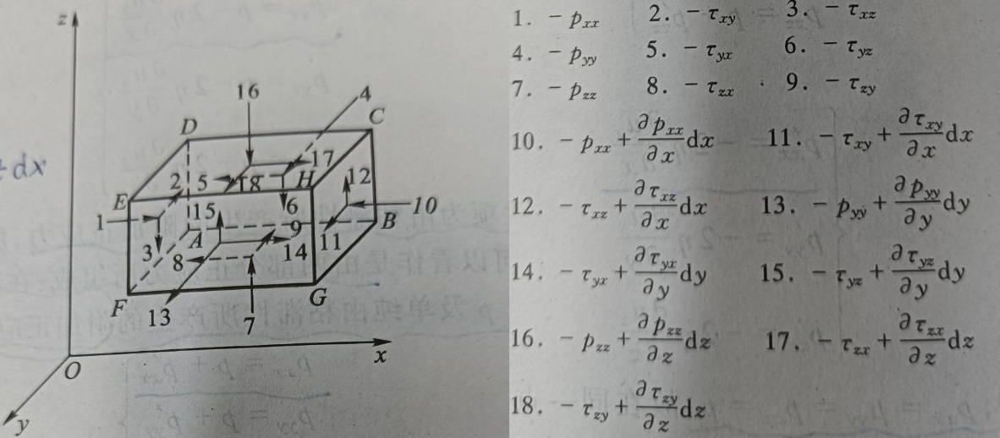

实际流体中任取一个微分平行六面体，密度 $ρ$，边长 $dx, dy, dz$；假设，  
速度沿各轴的正方向增大。  
在$x$方向动力平衡方程为：  

$$\begin{aligned}
f_x\rho\mathrm{d}x\mathrm{d}y\mathrm{d}z &+ p_{xx}\mathrm{d}y\mathrm{d}z - (p_{xx} + \frac{\partial p_{xx}}{\partial x}\mathrm{d}x)\mathrm{d}y\mathrm{d}z  \\
&- \tau_{zx}\mathrm{d}x\mathrm{d}y + (\tau_{zx} + \frac{\partial \tau_{zx}}{\partial z}\mathrm{d}z)\mathrm{d}x\mathrm{d}y \\
&- \tau_{yx}\mathrm{d}x\mathrm{d}z + (\tau_{yx} + \frac{\partial \tau_{yx}}{\partial y}\mathrm{d}y)\mathrm{d}x\mathrm{d}z \\
&= \rho\mathrm{d}x\mathrm{d}y\mathrm{d}z\frac{\mathrm{d} u_x}{\mathrm{d}t}
\end{aligned} \tag{8-1}$$

整理，得到：

$$f_x - \frac{1}{\rho}\frac{\partial p_{xx}}{\partial x} + \frac{1}{\rho}(\frac{\partial \tau_{zx}}{\partial z} + \frac{\partial \tau_{yx}}{\partial y}) = \frac{\mathrm{d} u_x}{\mathrm{d}t} \tag{8-2}$$

由此类推，即 **实际流体运动的应力微分方程**： 

$$\begin{cases}
\frac{\mathrm{d} u_x}{\mathrm{d}t} = f_x - \frac{1}{\rho}\frac{\partial p_{xx}}{\partial x} + \frac{1}{\rho}(\frac{\partial \tau_{zx}}{\partial z} + \frac{\partial \tau_{yx}}{\partial y})\\
  \\
\frac{\mathrm{d} u_y}{\mathrm{d}t} = f_y - \frac{1}{\rho}\frac{\partial p_{yy}}{\partial y} + \frac{1}{\rho}(\frac{\partial \tau_{zy}}{\partial z} + \frac{\partial \tau_{xy}}{\partial x}) \\
  \\
\frac{\mathrm{d} u_z}{\mathrm{d}t} = f_z - \frac{1}{\rho}\frac{\partial p_{zz}}{\partial z} + \frac{1}{\rho}(\frac{\partial \tau_{xz}}{\partial x} + \frac{\partial \tau_{yz}}{\partial y}) \\
\end{cases} \tag{8-3}$$

方程同时适用牛顿流体和非牛顿流体，同时适用层流运动和湍流运动。

*------------------ * ------------------*

层流运动时牛顿流体， 存在 **牛顿内摩擦定律**：  

$$\tau = \eta\frac{\mathrm{d}u}{\mathrm{d}s} = \eta\frac{\mathrm{d}\theta}{\mathrm{d}t}, \quad  \eta \text{ 为动力粘性系数} \tag{8-4}$$

层流时实际流体的角应变与流速梯度相等；粘性切应力与流速梯度成正比，与压力无关。  

根据 **达朗贝尔原理**，可得到 **切应力互等定理**：

$$\tau_{xz} = \tau_{zx}, \quad  \tau_{xy} = \tau_{yx}, \quad  \tau_{yz} = \tau_{zy} \tag{8-5}$$

进而，得到： 

$$\begin{cases}
\tau_{xz} = \tau_{zx} = \eta \theta_y = \eta (\frac{\partial u_x}{\partial z} + \frac{\partial u_z}{\partial x})  \\
  \\
\tau_{xy} = \tau_{yx} = \eta \theta_z = \eta (\frac{\partial u_x}{\partial y} + \frac{\partial u_y}{\partial x})  \\
  \\
\tau_{yz} = \tau_{zy} = \eta \theta_x = \eta (\frac{\partial u_y}{\partial z} + \frac{\partial u_z}{\partial y})  \\
\end{cases} \tag{8-6}$$

实际流体中动水压强各向不相等，采用任意三个正交方向作平均值 ：  

$$p = \frac{p_{xx} + p_{yy} + p_{zz}}{3} \tag{8-7}$$

分析，得到：

$$\begin{cases}
p_{xx} = p - 2\eta\frac{\partial u_x}{\partial x} = p + p_{xx}^{'} \\
  \\
p_{yy} = p - 2\eta\frac{\partial u_y}{\partial y} = p + p_{yy}^{'} \\
  \\
p_{zz} = p - 2\eta\frac{\partial u_z}{\partial z} = p + p_{zz}^{'} \\
\end{cases} \tag{8-8}$$

实际流体的动水压强可以看作由两部分组成，动水平均压强和粘滞性产生的附加正应力。  
附加正应力是沿流线的速度梯度产生的，加速时同方向质点间存在分离趋势、拉伸变形，  
附加正应力为拉应力，质点动水压强减小；反之，附加正应力为压应力，动水压强增大。

切应力与角应变方程 和 正应力与线应变方程，构成 **层流运动下牛顿流体的本构方程组**。  
代入实际流体应力方程，在 $x$ 方向得到：

$$\begin{aligned}
\frac{\mathrm{d} u_x}{\mathrm{d}t} &= \frac{\partial u_x}{\partial t} + u_x\frac{\partial u_x}{\partial x} + u_y\frac{\partial u_x}{\partial y} + u_z\frac{\partial u_x}{\partial z} = f_x - \frac{1}{\rho}\frac{\partial p_{xx}}{\partial x} + \frac{1}{\rho}(\frac{\partial \tau_{zx}}{\partial z} + \frac{\partial \tau_{yx}}{\partial y}) \\
  \\
&= f_x - \frac{1}{\rho}(\frac{\partial p}{\partial x} - 2\eta\frac{\partial^2 u_x}{\partial x^2}) + \frac{\eta}{\rho}(\frac{\partial^2 u_x}{\partial z^2} + \frac{\partial^2 u_z}{\partial x \partial z} + \frac{\partial^2 u_y}{\partial x \partial y} + \frac{\partial^2 u_x}{\partial y^2})  \\
  \\
&= f_x - \frac{1}{\rho}\frac{\partial p}{\partial x} + \frac{\eta}{\rho}(\frac{\partial^2 u_x}{\partial x^2} + \frac{\partial^2 u_x}{\partial y^2} + \frac{\partial^2 u_x}{\partial z^2}) + \frac{\eta}{\rho}\frac{\partial}{\partial x}(\frac{\partial u_x}{\partial x} + \frac{\partial u_y}{\partial y} + \frac{\partial u_z}{\partial z})\\
\end{aligned} \tag{8-9}$$

采用运动粘性系数 $\nu = \frac{\eta}{\rho}$，得到**可压缩粘性牛顿流体层流运动方程**：  

$$\begin{cases}
\frac{\mathrm{d} u_x}{\mathrm{d}t} = f_x - \frac{1}{\rho}\frac{\partial p}{\partial x} + \nu \nabla^2 u_x + \nu \frac{ \partial}{\partial x}( \nabla \cdot u)  \\
  \\
\frac{\mathrm{d} u_y}{\mathrm{d}t} = f_y - \frac{1}{\rho}\frac{\partial p}{\partial y} + \nu \nabla^2 u_y + \nu \frac{ \partial}{\partial y}( \nabla \cdot u)  \\
  \\
\frac{\mathrm{d} u_z}{\mathrm{d}t} = f_z - \frac{1}{\rho}\frac{\partial p}{\partial z} + \nu \nabla^2 u_z + \nu \frac{ \partial}{\partial z}( \nabla \cdot u)  \\
\end{cases} \tag{8-10}$$

不可压缩流体连续方程简化为 $\nabla \cdot u = 0$，得到 **不可压缩粘性牛顿流体层流运动方程** ，  
又被称为 **纳维 - 斯托克斯方程**：  

$$\begin{cases}
\frac{\mathrm{d} u_x}{\mathrm{d}t} = f_x - \frac{1}{\rho}\frac{\partial p}{\partial x} + \nu \nabla^2 u_x  \\
  \\
\frac{\mathrm{d} u_y}{\mathrm{d}t} = f_y - \frac{1}{\rho}\frac{\partial p}{\partial y} + \nu \nabla^2 u_y  \\
  \\
\frac{\mathrm{d} u_z}{\mathrm{d}t} = f_z - \frac{1}{\rho}\frac{\partial p}{\partial z} + \nu \nabla^2 u_z  \\
\end{cases} \tag{8-11}$$

方程适用不可压缩牛顿流体的层流运动；一般认为 $N-S$ 方程依然适用于湍流运动。  
$N-S$ 方程与连续方程组成的微分方程组，未知参数为 $u_x,u_y,u_z,p$，若 $\rho,\eta$ 不变，  
此时方程系统封闭，系统状态可解。

对于 纳维 - 斯托克斯方程：  

$$\begin{pmatrix}
\frac{\mathrm{d} u_x}{\mathrm{d}t} \\ 
  \\
\frac{\mathrm{d} u_y}{\mathrm{d}t} \\
  \\
\frac{\mathrm{d} u_z}{\mathrm{d}t} \\
\end{pmatrix} = \begin{pmatrix}
\frac{\partial u_x}{\partial t} + u_x\frac{\partial u_x}{\partial x} + u_y\frac{\partial u_x}{\partial y} + u_z\frac{\partial u_x}{\partial z}  \\
  \\
\frac{\partial u_y}{\partial t} + u_x\frac{\partial u_y}{\partial x} + u_y\frac{\partial u_y}{\partial y} + u_z\frac{\partial u_y}{\partial z}  \\
  \\
\frac{\partial u_z}{\partial t} + u_x\frac{\partial u_z}{\partial x} + u_y\frac{\partial u_z}{\partial y} + u_z\frac{\partial u_z}{\partial z}  \\
\end{pmatrix} = \begin{pmatrix}
f_x \\
  \\
f_y \\
  \\
f_z \\
\end{pmatrix} - \frac{1}{\rho}
\begin{pmatrix}
\frac{\partial p}{\partial x}  \\
  \\
\frac{\partial p}{\partial y}  \\
  \\
\frac{\partial p}{\partial z}  \\
\end{pmatrix} + \frac{\eta}{\rho}
\begin{pmatrix}
\frac{\partial^2 u_x}{\partial x^2} + \frac{\partial^2 u_x}{\partial y^2} + \frac{\partial^2 u_x}{\partial z^2}  \\
  \\
\frac{\partial^2 u_y}{\partial x^2} + \frac{\partial^2 u_y}{\partial y^2} + \frac{\partial^2 u_y}{\partial z^2}  \\
  \\
\frac{\partial^2 u_z}{\partial x^2} + \frac{\partial^2 u_z}{\partial y^2} + \frac{\partial^2 u_z}{\partial z^2}  \\
\end{pmatrix}$$

$$\Rightarrow \rho [\frac{\partial \textbf{u}}{\partial t} + (\nabla \cdot \textbf{u}) \textbf{u}] = \rho \textbf{f} - \nabla p + \eta \nabla^2 \textbf{u} \tag{8-12}$$

方程的左端为流体单元的**动量变化率（惯性项）**，方程右端为作用在流体单元上的**各种作用力**：  
$$\begin{cases}
\frac{\partial \textbf{u}}{\partial t}，\text{时间项，表示方程可以描述非稳态流场}； \\
  \\
(\nabla \cdot \textbf{u})  \textbf{u},\text{对流项，表征流场运动要素在空间的传递，加大速度梯度使流场更不光滑}； \\
  \\
\rho \textbf{f}，\text{源项（质量力），每个时刻外部环境施加的作用引起的增长率}；  \\
  \\
\nabla p,\text{压力项，使速度场满足不可压缩条件，使速度梯度增大从而使流场更加不光滑}；  \\
  \\
\eta \nabla^2 \textbf{u},\text{粘性项、扩散项（粘性力），来自分子间的动量交换，使得速度梯度变光滑}；
\end{cases}$$

*------------------ * ------------------*

对于不可压缩流体，$\nabla \cdot u = 0$，乘以 $\rho u_x$，得到：  

$$\rho u_x \frac{\partial u_x}{\partial x} + \rho u_x \frac{\partial u_y}{\partial y}  + \rho u_x \frac{\partial u_z}{\partial z} = 0 \tag{8-13}$$

代入实际流体应力方程，在 $x$ 方向得到： 

$$\begin{aligned}
\rho f_x - \frac{\partial p_{xx}}{\partial x} + \frac{\partial \tau_{yx}}{\partial y} + \frac{\partial \tau_{zx}}{\partial z}  &= \rho \frac{\partial u_x}{\partial t} + 2\rho u_x\frac{\partial u_x}{\partial x} + \rho (u_y\frac{\partial u_x}{\partial y} + u_x\frac{\partial u_y}{\partial y}) + \rho (u_z\frac{\partial u_x}{\partial z} + \frac{\partial u_z}{\partial z})  \\
  \\
&= \rho \frac{\partial u_x}{\partial t} + \rho \frac{\partial u_{x}^{2}}{\partial x} + \rho \frac{\partial u_x u_y}{\partial y} + \rho \frac{\partial u_x u_z}{\partial z}
\end{aligned} \tag{8-14}$$

整理，得到：

$$\rho \frac{\partial u_x}{\partial t} = \rho f_x - \frac{\partial}{\partial x}(p_{xx} + \rho u_{x}^{2}) + \frac{\partial}{\partial y}(\tau_{yx} - \rho u_x u_y) + \frac{\partial}{\partial z}(\tau_{zx} - \rho u_x u_z) \tag{8-15}$$

类推，得到： 

$$\begin{cases}
\rho \frac{\partial u_x}{\partial t} = \rho f_x - \frac{\partial}{\partial x}(p_{xx} + \rho u_{x}^{2}) + \frac{\partial}{\partial y}(\tau_{yx} - \rho u_x u_y) + \frac{\partial}{\partial z}(\tau_{zx} - \rho u_x u_z) \\
  \\
\rho \frac{\partial u_y}{\partial t} = \rho f_y - \frac{\partial}{\partial y}(p_{yy} + \rho u_{y}^{2}) + \frac{\partial}{\partial x}(\tau_{xy} - \rho u_x u_y) + \frac{\partial}{\partial z}(\tau_{zy} - \rho u_y u_z)  \\
  \\
\rho \frac{\partial u_z}{\partial t} = \rho f_z - \frac{\partial}{\partial z}(p_{zz} + \rho u_{z}^{2}) + \frac{\partial}{\partial x}(\tau_{xz} - \rho u_x u_z) + \frac{\partial}{\partial y}(\tau_{yz} - \rho u_y u_z) \\
\end{cases} \tag{8-16}$$ 

作为实际流体应力微分方程的一种变形，同样适用于层流和湍流、牛顿流体和非牛顿流体。  
对于湍流，由于瞬时运动要素存在脉动现象，因此分析中经常采取**时均方法**转换应力方程。  

例如，对于流速$u_x = \overline{u_x} + u_{x}^{'}$，即：  
$u_x$ 看作为由时均流速$\overline{u_x}$和脉动流速 $u_{x}^{'}$ 构成，$\overline{u_x}$ 可视为消除脉动后线性变化的流速 $u_x$。  

类似，重构速度和应力，即可以得到：   

速度： $\begin{cases}
u_x = \overline{u_x} + u_{x}^{'} \\
u_y = \overline{u_y} + u_{y}^{'} \\
u_z = \overline{u_z} + u_{z}^{'} \\
\end{cases}$， 表面应力：$\begin{cases}
p_{xx} = \overline{p_{xx}} + p_{xx}^{'}  \\
\tau_{yx} = \overline{\tau_{yx}} + \tau_{yx}^{'}  \\
\tau_{zx} = \overline{\tau_{zx}} + \tau_{zx}^{'}  \\
\end{cases}$， 惯性应力： $\begin{cases}
f_x = \overline{f_x} + f_{x}^{'}  \\
f_y = \overline{f_y} + f_{y}^{'}  \\
f_z = \overline{f_z} + f_{z}^{'}  \\
\end{cases}$  

对连续性方程时间平均，即可以得到：

$$\nabla\cdot\overline{u} = 0 \tag{8-17}$$

对应力方程时间平均，$x$ 方向可得到：  

$$\begin{gathered}
\rho \frac{1}{T}\int_{0}^{T} \frac{\partial u_x}{\partial t}  \mathrm{d}t = \\
  \\
\frac{1}{T}[\rho \int_{0}^{T} f_x \mathrm{d}t - \int_{0}^{T} \frac{\partial}{\partial x}(p_{xx} + \rho u_{x}^{2}) \mathrm{d}t + \int_{0}^{T} \frac{\partial}{\partial y}(\tau_{yx} - \rho u_x u_y) \mathrm{d}t + \int_{0}^{T} \frac{\partial}{\partial z}(\tau_{zx} - \rho u_x u_z) \mathrm{d}t] 
\end{gathered} \tag{8-18}$$

其中，一阶脉动变量项因积分消失：  

$$\begin{cases}
\frac{1}{T}\int_{0}^{T} \frac{\partial u_x}{\partial t}  \mathrm{d}t = \frac{1}{T}\int_{0}^{T} \frac{\partial \overline{u_x}}{\partial t}  \mathrm{d}t + \frac{1}{T}\int_{0}^{T} \frac{\partial u_{x}^{'}}{\partial t}  \mathrm{d}t = \frac{\partial \overline{u_x}}{\partial t} + 0 = \frac{\partial \overline{u_x}}{\partial t} \\
  \\
\frac{1}{T}\int_{0}^{T}  f_x   \mathrm{d}t = \frac{1}{T}\int_{0}^{T} \overline{f_x}  \mathrm{d}t + \frac{1}{T}\int_{0}^{T} f_{x}^{'}  \mathrm{d}t = \overline{f_x} 
\end{cases} \tag{8-19}$$

对高阶脉动项，一次时均得到均值：  

$$\begin{aligned}
\frac{1}{T}\int_{0}^{T} \frac{\partial}{\partial x}(p_{xx} + u_{x}^{2})  \mathrm{d}t &= \frac{1}{T}\int_{0}^{T} \frac{\partial}{\partial x}(\overline{p_{xx}} + p_{xx}^{'}) \mathrm{d}t + \frac{1}{T}\int_{0}^{T} \frac{\partial}{\partial x}(\overline{u_x} + u_{x}^{'})^2 \mathrm{d} t  \\
&= \frac{\partial \overline{p_{xx}}}{\partial x} + \frac{\rho}{T}\int_{0}^{T} \frac{\partial}{\partial x}(\overline{u_x}^2 + 2\overline{u_x}u_{x}^{'} + u_{x}^{'2})  \mathrm{d}t \\
&= \frac{\partial }{\partial x} (\overline{p_{xx}} + \rho  \overline{u_x}^2 + \rho  \overline{u_{x}^{'2}})
\end{aligned}  \tag{8-20}$$

由此，得到： 

$$\begin{aligned}
\rho \frac{\partial \overline{u_x}}{\partial t} = \rho \overline{f_x} &- \frac{\partial }{\partial x} (\overline{p_{xx}} + \rho  \overline{u_x}^2 + \rho  \overline{u_{x}^{'2}}) + \frac{\partial}{\partial y}(\overline{\tau_{yx}} - \rho  \overline{u_x}  \overline{u_y} - \rho  \overline{u_{x}^{'} u_{y}^{'}}) \\
&+ \frac{\partial}{\partial z}(\overline{\tau_{zx}} - \rho  \overline{u_x} \overline{u_z} - \rho  \overline{u_{x}^{'} u_{z}^{'}})
\end{aligned}  \tag{8-21}$$

进而，得到 **湍流时均微分方程**，又称 **雷诺时均方程（RANS）**：  
$$\begin{cases}
\frac{\partial \overline{u_x}}{\partial t} = \overline{f_x} - \frac{\partial }{\partial x} (\overline{p_{xx}} + \frac{1}{\rho}  \overline{u_x}^2 + \frac{1}{\rho}  \overline{u_{x}^{'2}}) + \frac{\partial}{\partial y}(\overline{\tau_{yx}} - \frac{1}{\rho}  \overline{u_x}  \overline{u_y} - \frac{1}{\rho}  \overline{u_{x}^{'} u_{y}^{'}}) + \frac{\partial}{\partial z}(\overline{\tau_{zx}} - \frac{1}{\rho}  \overline{u_x} \overline{u_z} - \frac{1}{\rho}  \overline{u_{x}^{'} u_{z}^{'}})  \\
  \\
\frac{\partial \overline{u_y}}{\partial t} = \overline{f_y} - \frac{\partial }{\partial y} (\overline{p_{yy}} + \frac{1}{\rho}  \overline{u_y}^2 + \frac{1}{\rho}  \overline{u_{y}^{'2}}) + \frac{\partial}{\partial x}(\overline{\tau_{xy}} - \frac{1}{\rho}  \overline{u_x}  \overline{u_y} - \frac{1}{\rho}  \overline{u_{x}^{'} u_{y}^{'}}) + \frac{\partial}{\partial z}(\overline{\tau_{zy}} - \frac{1}{\rho}  \overline{u_y} \overline{u_z} - \frac{1}{\rho}  \overline{u_{y}^{'} u_{z}^{'}})  \\
  \\
\frac{\partial \overline{u_z}}{\partial t} = \overline{f_z} - \frac{\partial }{\partial z} (\overline{p_{zz}} + \frac{1}{\rho}  \overline{u_z}^2 + \frac{1}{\rho}  \overline{u_{z}^{'2}}) + \frac{\partial}{\partial x}(\overline{\tau_{xz}} - \frac{1}{\rho}  \overline{u_x}  \overline{u_z} - \frac{1}{\rho}  \overline{u_{x}^{'} u_{z}^{'}}) + \frac{\partial}{\partial y}(\overline{\tau_{yz}} - \frac{1}{\rho}  \overline{u_y} \overline{u_z} - \frac{1}{\rho}  \overline{u_{y}^{'} u_{z}^{'}})  \\
\end{cases}$$

方程表明，湍流的时均应力可视为由两部份构成 ：  
+ 时均流速 $\overline{u}$ 所构成的层流运动所产生的应力；
+ 脉动流速 $u^{'}$产生的附加应力，又称 **雷诺应力**。

湍流瞬时运动要素以时均及脉动运动代替，未知量增加 6 个附加正应力，但方程数量未增加。  
通过引入新的方程，使方程组封闭，采用适当的数值计算方法，从而构成一个**湍流数学模型**。

*------------------ * ------------------*

实际流体运动由于粘性，接触固体表面会形成一层流速分布不均匀的减速薄层，即为**边界层**。  
由此，粘性液流分成两个区域：  
1. 在边界层外的主流，流速梯度为0，无内摩擦力，可以视为理想流体运动，符合势流运动规律；
2. 在边界层内的粘性流动，流速自0 增至主流速$U_0$、梯度很大，内摩擦力显著，采用 N-S 方程。

在边界层内，与粘性力相比，质量力可以忽略，得到：  

$$\rho [\frac{\partial \textbf{u}}{\partial t} + (\nabla \cdot \textbf{u}) \textbf{u}] = - \nabla p + \eta \nabla^2 \textbf{u} \tag{8-23}$$

进一步，考虑恒定二维流动：  

$$\begin{cases}
u_x\frac{\partial u_x}{\partial x} + u_y\frac{\partial u_x}{\partial y} = - \frac{1}{\rho}\frac{\partial p}{\partial x} + \nu (\frac{\partial^2 u_x}{\partial x^2} + \frac{\partial^2 u_x}{\partial y^2})  \\
  \\
u_x\frac{\partial u_y}{\partial x} + u_y\frac{\partial u_y}{\partial y} = - \frac{1}{\rho}\frac{\partial p}{\partial x} + \nu (\frac{\partial^2 u_y}{\partial x^2} + \frac{\partial^2 u_y}{\partial y^2})  \\
  \\
\frac{\partial u_x}{\partial x} + \frac{\partial u_y}{\partial y} = 0 \\
\end{cases} \tag{8-24}$$

$x$ 为沿固体表面的距离($0 \sim l$)；$y$ 为边界层厚度($0 \sim δ$)；$u_x$ 为沿固体表面流速($0 \sim U_0$)。   
同时可知，$\frac{\delta}{l}$ 是一个微小量。

利用边界层内液流的运动特性，对方程各项作 **量纲分析** 和 **数量级分析**：  

$$y \sim \delta, \quad x \sim l, \quad  u_x \sim U_0, \quad \frac{\partial u_x}{\partial y} \sim \frac{U_0}{\delta}, \quad \frac{\partial^2 u_x}{\partial y^2} \sim \frac{U_0}{\delta^2}, \quad \frac{\partial u_x}{\partial x} \sim \frac{U_0}{l}, \quad \frac{\partial^2 u_x}{\partial x^2} \sim \frac{U_0}{l^2}$$

由连续性方程 $\frac{\partial u_x}{\partial x} = - \frac{\partial u_y}{\partial y}$，可知二者具有相同数量级：  

$$\frac{\partial u_y}{\partial y} \sim \frac{U_0}{l}, \quad \frac{\partial^2 u_y}{\partial y^2} \sim \frac{U_0}{l \delta} \tag{8-26}$$

因为 $u_y = \int_{0}^{y} \frac{\partial u_y}{\partial y} \mathrm{d}y$，则有：  

$$u_y \sim \frac{U_0}{l}\delta, \quad \frac{\partial u_y}{\partial x} \sim \frac{U_0\delta}{l^2}，\quad \frac{\partial^2 u_y}{\partial x^2} \sim \frac{U_0\delta}{l^3} \tag{8-27}$$

根据上列方程组各项的数量级，进行分析比较可以得出 ：  

1. x 方向，惯性项 $u_x\frac{\partial u_x}{\partial x}, u_y\frac{\partial u_x}{\partial y}$ 为同一数量级，二者相比，无法忽略其中某项；

2. x 方向，粘性项 $\frac{\partial^2 u_x}{\partial x^2}, \frac{\partial^2 u_x}{\partial y^2}$，数量级比例 $\frac{U_0}{l^2} : \frac{U_0}{\delta^2} = (\frac{\delta}{l})^2$ 是一个微小值的平方，忽略前者；  

3. y 方向，惯性项 $u_x\frac{\partial u_y}{\partial x}, u_y\frac{\partial u_y}{\partial y}$ 为同一数量级，二者相比，无法忽略其中某项；  

4. y 方向，粘性项 $\frac{\partial^2 u_y}{\partial x^2}, \frac{\partial^2 u_y}{\partial y^2}$，数量级比例$\frac{U_0 \delta}{l^3} : \frac{U_0}{l\delta} = (\frac{\delta}{l})^2$ 是一个微小值的平方，忽略前者；

经此，方程继续简化：  

$$\begin{cases}
u_x\frac{\partial u_x}{\partial x} + u_y\frac{\partial u_x}{\partial y} = - \frac{1}{\rho}\frac{\partial p}{\partial x} + \nu \frac{\partial^2 u_x}{\partial y^2}  \\
  \\
u_x\frac{\partial u_y}{\partial x} + u_y\frac{\partial u_y}{\partial y} = - \frac{1}{\rho}\frac{\partial p}{\partial x} + \nu \frac{\partial^2 u_y}{\partial y^2}  \\
  \\
\frac{\partial u_x}{\partial x} + \frac{\partial u_y}{\partial y} = 0 \\
\end{cases} \tag{8-28}$$

继续分析，可以发现：
+ y 方向的惯性项相比 x 方向，比例 $\frac{\delta}{l}$ 是一个微小量，故忽略前者对方程解的精确度并无影响；
+ y 方向的粘性项相比 x 方向，比例 $\frac{\delta}{l}$ 是一个微小量，故忽略前者对方程解的精确度并无影响；

因此方程进一步简化，得到恒定二维流场的 **边界层微分方程**：

$$\begin{cases}
u_x\frac{\partial u_x}{\partial x} + u_y\frac{\partial u_x}{\partial y} = - \frac{1}{\rho}\frac{\partial p}{\partial x} + \nu \frac{\partial^2 u_x}{\partial y^2}  \\
  \\
\frac{\partial p}{\partial x} = 0 \\
  \\
\frac{\partial u_x}{\partial x} + \frac{\partial u_y}{\partial y} = 0 \\
\end{cases} \tag{8-29}$$

方程基于平面绕流，一般适用曲率较小的曲面边界层：固体表面曲线为$x$轴，曲线法向为$y$轴。

[<i class="fa fa-home"></i>](#纳维-斯托克斯方程组)

*--- 补充：---*   
1. 若速度沿各轴正向增大，$\tau_{zx}$ 对作用面起阻滞作用，$\tau_{zx} + \frac{\partial \tau_{zx}}{\partial z}\mathrm{d}z$ 起推动作用；其他类推。

2. 达朗贝尔原理，在质点运动的任一时刻，主动力F、约束力Fn 与惯性力构成平衡力系：  
$$ F + F_N + (-m \cdot a) = 0 $$

3. 切应力互等定理，相互垂直平面上，切应力成对存在且大小相等，同垂直于平面交线：  
$$\tau_{xz} = \tau_{zx}, \quad  \tau_{xy} = \tau_{yx}, \quad  \tau_{yz} = \tau_{zy}$$

4. N-S 方程可以认为**玻尔兹曼方程**在近似平衡态下 (层流) 的一阶近似 (欧拉方程是零阶近似)。  

5. 稳态N-S 方程即恒定流N-S 方程，但得到的稳态解仍是不稳定的，微小扰动会被无限放大。

*--- 附录：---*  

关于 **转动** 与 **平动** ：
+ 力，改变物体平动状态；力矩，改变物体转动状态；$T = s \times F$，力矩是位移与力的矢积。
+ 如果一个系统，在研究过程中，不受外力作用（$\sum F = 0$），那么这个系统的总动量守恒。
+ 如果一个系统，在研究过程中，不受外力矩作用（$\sum T = 0$），这个系统的总角动量守恒。
+ 物体达到静平衡的条件，$\sum F = 0  \quad  And  \quad  \sum T = 0$ 。

---------------------------------------------------------------------------------

## 实际流体的能量方程

*The Energy Equation of Real Fluid*

基于任意微分平行六面体对象，关于 **控制体** 的能量守恒方程的表述，采用 **输运方程** 的框架，得到：

控制体内能量时变率 +（控制体输出能量通量 - 控制体输入能量通量）
= 外界传热速率 + 外界做功速率

实际流体中任取微分平行六面体，密度 $ρ$，边长 $dx, dy, dz$；假设，速度、温度沿各轴正向增大。

单位时间内，控制体能量时间变化率： 

$$\frac{\partial}{\partial t} (\rho e_s\mathrm{d}x\mathrm{d}y\mathrm{d}z) = \frac{\partial e_s}{\partial t}\rho\mathrm{d}x\mathrm{d}y\mathrm{d}z + e_s\frac{\partial}{\partial t}(\rho\mathrm{d}x\mathrm{d}y\mathrm{d}z) = \frac{\partial e_s}{\partial t}\rho\mathrm{d}x\mathrm{d}y\mathrm{d}z \tag{9-1}$$

沿$x$方向，控制体的净输出能量通量：

$$\Delta e_x = (e_s + \frac{\partial e_s}{\partial x}\mathrm{d}x)(u_x + \frac{\partial u_x}{\partial x}\mathrm{d}x)\rho\mathrm{d}y\mathrm{d}z - e_s u_x \rho \mathrm{d}y\mathrm{d}z = \frac{\partial u_x e_s}{\partial x} \rho \mathrm{d}x\mathrm{d}y\mathrm{d}z \tag{9-2}$$

由此类推，控制体的净输出能量通量：  

$$\begin{cases}
\Delta e_x = \frac{\partial u_x e_s}{\partial x} \rho \mathrm{d}x\mathrm{d}y\mathrm{d}z \\
  \\
\Delta e_y = \frac{\partial u_y e_s}{\partial y} \rho \mathrm{d}x\mathrm{d}y\mathrm{d}z \\
  \\
\Delta e_z = \frac{\partial u_z e_s}{\partial z} \rho \mathrm{d}x\mathrm{d}y\mathrm{d}z \\
\end{cases} \tag{9-3}$$

由此，**控制体内单位质量能量变化率**：  

$$\frac{\mathrm{d} e_s}{\mathrm{d} t} = \rho\frac{\partial e_s}{\partial t} + \Delta e_x + \Delta e_y + \Delta e_z = \rho(\frac{\partial e_s}{\partial t} + \frac{\partial u_x e_s}{\partial x} + \frac{\partial u_y e_s}{\partial y} + \frac{\partial u_z e_s}{\partial z}) \tag{9-4}$$

单位时间内，**质量力做功速率**：  

$$W_{m,x} = f_x u_x \rho \mathrm{d}x\mathrm{d}y\mathrm{d}z, \quad   W_{m,y} = f_y u_y \rho \mathrm{d}x\mathrm{d}y\mathrm{d}z, \quad   W_{m,z} = f_z u_z \rho \mathrm{d}x\mathrm{d}y\mathrm{d}z \tag{9-5}$$

在 $x$ 方向上，表面力的做功速率为 ：  
$$\begin{cases}
\textbf{x 方向前后切面}，(p_{xx} + \frac{\partial p_{xx}}{\partial x}\mathrm{d}x) \mathrm{d}y\mathrm{d}z (u_x + \frac{\partial u_x}{\partial x}\mathrm{d}x) - p_{xx} u_x \mathrm{d}y\mathrm{d}z; \\
  \\
\textbf{x 方向左右切面}，(\tau_{yx} + \frac{\partial \tau_{yx}}{\partial y}\mathrm{d}y) \mathrm{d}x\mathrm{d}z (u_x + \frac{\partial u_x}{\partial y}\mathrm{d}y) - \tau_{yx} u_x \mathrm{d}x\mathrm{d}z; \\
  \\
\textbf{x 方向上下切面}，(\tau_{zx} + \frac{\partial \tau_{zx}}{\partial z}\mathrm{d}z) \mathrm{d}x\mathrm{d}y (u_x + \frac{\partial u_x}{\partial z}\mathrm{d}z) - \tau_{zx} u_x \mathrm{d}x\mathrm{d}y; \\
\end{cases} $$

$$\Rightarrow (\frac{\partial p_{xx} u_x}{\partial x} + \frac{\partial \tau_{yx} u_x}{\partial y} + \frac{\partial \tau_{zx} u_x}{\partial z}) \mathrm{d}x\mathrm{d}y\mathrm{d}z \tag{9-6}$$

由此类推，**表面力做功速率**：  

$$\begin{cases}
W_{s,x} = (\frac{\partial p_{xx} u_x}{\partial x} + \frac{\partial \tau_{yx} u_x}{\partial y} + \frac{\partial \tau_{zx} u_x}{\partial z}) \mathrm{d}x\mathrm{d}y\mathrm{d}z  \\
  \\
W_{s,y} = (\frac{\partial p_{yy} u_y}{\partial y} + \frac{\partial \tau_{xy} u_y}{\partial x} + \frac{\partial \tau_{zy} u_y}{\partial z}) \mathrm{d}x\mathrm{d}y\mathrm{d}z  \\
  \\
W_{s,z} = (\frac{\partial p_{zz} u_z}{\partial z} + \frac{\partial \tau_{xz} u_z}{\partial x} + \frac{\partial \tau_{yz} u_z}{\partial x}) \mathrm{d}x\mathrm{d}y\mathrm{d}z  \\
\end{cases} \tag{9-7}$$

由此，**控制体单位质量外界做功速率**：  

$$\begin{gathered}
\frac{\mathrm{d}W}{\mathrm{d}t} = \rho f_x u_x + \rho f_y u_y + \rho f_z u_z + \\
\frac{\partial}{\partial x}(p_{xx}u_x + \tau_{yx} u_y + \tau_{zx} u_z) + \frac{\partial}{\partial y}(p_{yy}u_y + \tau_{xy} u_x + \tau_{zy} u_z) + \frac{\partial}{\partial z}(p_{zz} u_z + \tau_{xz} u_x + \tau_{yz} u_y)  \\
\end{gathered} \tag{9-8}$$

设单位时间内由辐射传入单位质量流体的热量为 $q$，则单位时间内获得**辐射热**：  

$$q\rho\mathrm{d}x\mathrm{d}y\mathrm{d}z \tag{9-9}$$

由于导热使从高温区传导到低温区，根据**傅里叶定律**，$x$ 方向上控制体传导热：  

$$J_{T,x}\mathrm{d}y\mathrm{d}z - (J_{T,x} + \frac{\partial J_{T,x}}{\partial x}\mathrm{d}x)\mathrm{d}y\mathrm{d}z = \kappa \frac{\partial^2 T}{\partial x^2}\mathrm{d}x\mathrm{d}y\mathrm{d}z \tag{9-10}$$

由此类推，单位时间内获得**传导热**：  

$$(\kappa \frac{\partial^2 T}{\partial x^2} + \kappa \frac{\partial^2 T}{\partial y^2} + \kappa \frac{\partial^2 T}{\partial z^2})\mathrm{d}x\mathrm{d}y\mathrm{d}z = (\nabla^2 T) \kappa\mathrm{d}x\mathrm{d}y\mathrm{d}z \tag{9-11}$$

综合以上分析，根据热力学第一定律，从而得到**不可压缩实际流体的能量方程**：    

$$\frac{\mathrm{d} e_s}{\mathrm{d} t} = f_m \cdot u + \frac{1}{\rho} \nabla (f_s \cdot u) + \frac{1}{\rho} \nabla^2 (\kappa T) + q  \tag{9-12}$$

[<i class="fa fa-home"></i>](#纳维-斯托克斯方程组)

*--- 注意：---*  
1. 傅里叶定律：导热现象中，单位时间内通过给定截面的热量，正比于垂直于该截面方向上的  
温度梯度和截面面积，而热量传递的方向则与温度升高的方向相反。  
沿 $x$ 方向的热流密度 $J_{T,x} (W\cdot m^{-2})$，导热系数 $\kappa (W\cdot m^{-1}\cdot K^{-1})$，则 $J_{T,x} = -\kappa \frac{\partial T}{\partial x}$ 。

---------------------------------------------------------------------------------

## 本章作者

*Authors*

[1] **朗月**，“ 希望这篇文章能够为你提供帮助，如有错误望不吝指正，欢迎交流！:D ”    

---------------------------------------------------------------------------------

## 参考资料

*References*

[1] 吴持恭. 水力学：上、下册[M]. 高等教育出版社, 2007.    
[2] 王船海,李光炽. 实用河网水流计算[M]. 河海大学水资源水文系, 2003-9. 

---------------------------------------------------------------------------------

