

---------------------------------------------------------------------------------

# 圣维南模型

*Saint-Venant Model*  

**流束理论**，将微小流束看成是水流总流的一个微元体，水流总流就是由无数微小流束组成。  
如此，只要找出微小流束的运动规律，然后对整个水流积分，即得到水流总流的运动规律。  

**微小流束**，充满以流管为边界的一束水流。

在对总流的积分过程中，以断面平均流速替代断面上各点的流速，其误差用动能修正系数、  
动量修正系数等加以修正。因此，  
在流束理论中实际将水流运动视为一元流动，只考虑沿流束轴线方向的运动，而忽略了与，  
轴线垂直方向的横向运动，局限。

*面对无数质点构成的连续介质，如何描述整个水流的运动规律？*

**运动学（Kinematics）**，从几何角度（不涉及流体的物理性质和受力状况) 研究流体的运动特性，  
即质点位置的改变。

研究的是运动本身，主要是表述质点的速度、加速度和空间位置这几个量之间的大小和方向关系；  
不涉及受力分析。 运动学分析可以得到以角度、速度、加速度等组成的的运动学方程。  

**动力学（Dynamics）**，主要研究作用于流体的力与流体运动的关系。  

研究的是流体在运动状态下，作用在流体上的外力与运动要素之间的联系，以及流体的运动特性、  
能量之间的转换等。  
动力学分析可以得到以流体受力情况、加速度等项组成的动力学方程。  

动力学与运动学间联系紧密，沟通的桥梁即$F=m·a$，动力学分析的前提必须进行运动学分析。

+ [恒定流模型](#恒定流基本方程组)
  + [恒定流基本方程组](#恒定流基本方程组)：恒定总流连续性方程、能量方程、动量方程及相关。
  + [明渠恒定均匀流动](#明渠恒定均匀流)：明渠均匀流谢齐公式。
  + [明渠恒定非均匀流](#明渠恒定非均匀流)：弗洛德数和流态划分、波速公式、明渠非均匀渐变流基本方程等等。
+ [非恒定流模型](#非恒定流基本方程组)
  + [非恒定流基本方程组](#非恒定流基本方程组)：非恒定流连续性方程、能量方程、动量方程等等。
  + [明渠非恒定渐变流](#明渠非恒定渐变流)：圣维南方程、变位波。
  + [明渠非恒定急变流](#明渠非恒定急变流)：非恒定急变流连续方程、动量方程，波峰流量方程。

---------------------------------------------------------------------------

## 恒定流基本方程组

*The Basic Equations of Steady Flow*

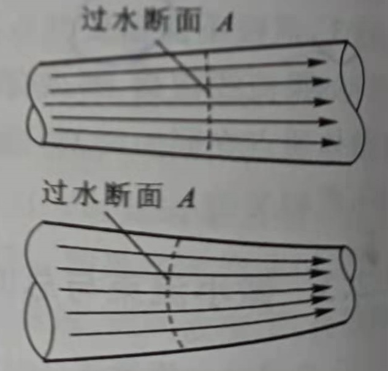
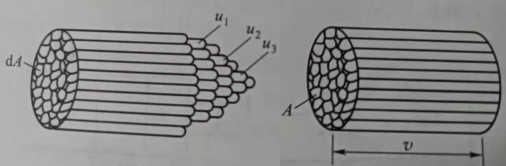

**过水断面**，即与微小流束或总流的流线成正交的横断面（根据流线的情况，可能是平面或曲面）。  
**流量**，即单位时间内通过某过水断面的的水流体积。  
设在总流中任取一微小流束，过水断面积为$dA$；假设微小流束过水断面上各点流速相等（为$u$）：  

$$u \mathrm{d} A = \mathrm{d} Q  \tag{1-1}$$

通过总流过水断面$A$的流量，对微小流束积分可得： 

$$Q = \int_Q \mathrm{d} Q = \int_A u \mathrm{d} A = v A \tag{1-2}$$

**断面平均流速 $v$**，当过水断面上各点流速均为该值时通过的流量，与实际流速分布下的流量相等。  

*------------------ * ------------------*

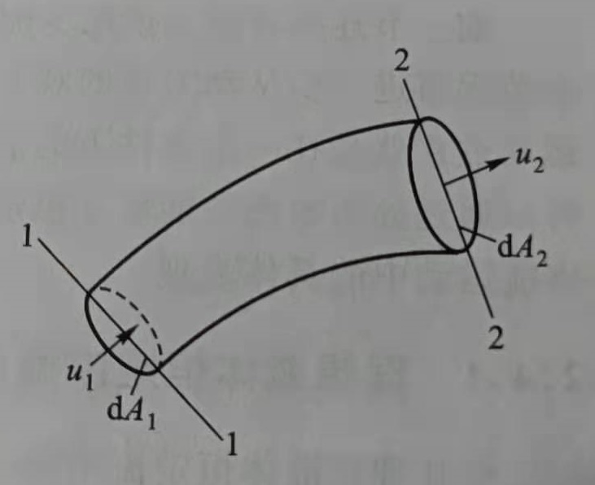
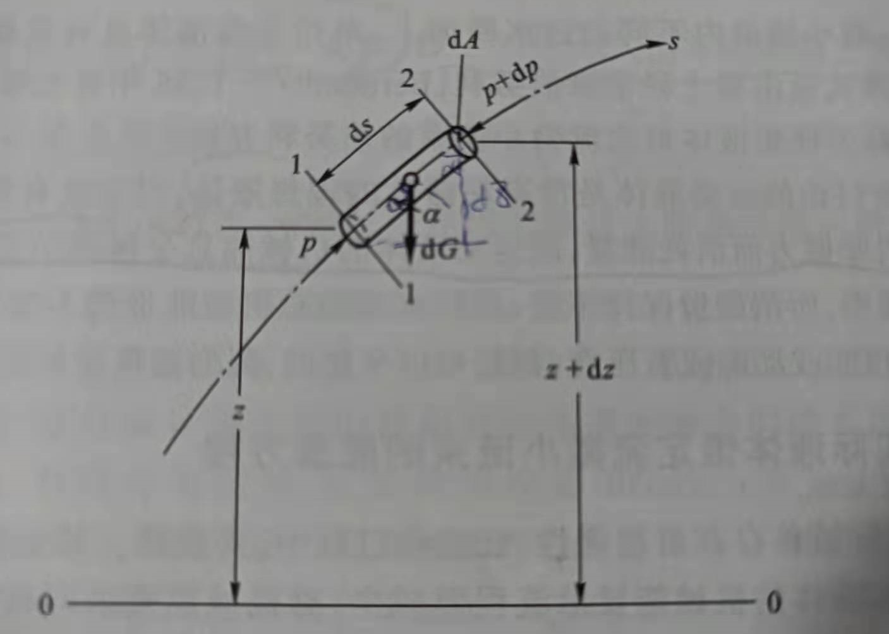

在恒定流中，微小流束的形状和尺寸是不随时间而改变的，而且通过微小流束的侧壁没有水流  
的流入或流出。  
对不可压缩水流，根据质量守恒定律，  
分析可以得到 **恒定总流的连续性方程**： 

$$\int_Q \mathrm{d} Q = \int_{A1} u_1 \mathrm{d} A_1 = \int_{A2} u_2 \mathrm{d} A_2 \quad \Rightarrow \quad Q = v_1 A_1 = v_2 A_2 \tag{1-3}$$

*------------------ * ------------------*

**理想水流**恒定流的微小流束上，侧壁摩擦力为 0；根据牛顿第二定律，  
对微分流段沿 $s$ 方向作受力分析： 

$$p \mathrm{d} A - (p + \mathrm{d} p) \mathrm{d} A - \rho g \mathrm{d} A \mathrm{d} s \cos \alpha =  \rho g \mathrm{d} A \mathrm{d} s \frac{\mathrm{d} u}{\mathrm{d} t} \tag{1-4}$$

一维流动中，可以得到：  

$$\frac{\mathrm{d} u}{\mathrm{d} t} = u \frac{\mathrm{d} u}{\mathrm{d} s} = \frac{\mathrm{d} }{\mathrm{d} s}(\frac{u^2}{2}) \tag{1-5}$$

上式代入$(1-4)$后沿流程积分，得到 **理想水流恒定流微小流束的能量方程（伯努利方程）**：  

$$z + \frac{p}{\rho g} + \frac{u^2}{2 g} = const \tag{1-6}$$

方程表明，在理想水流恒定流运动的情况下，微小流束内不同的过水断面上单位重量水流具有  
相同大小的机械能。  
对于实际水流，因为粘滞性的存在，故流动过程中要消耗一部分能量用于克服摩擦力而做功，  
机械能会沿程减少：  
令单位重量水流从断面 $1-1$ 流至 $2-2$ 损失能量为 $h_{w}^{'}$：

$$z_1 + \frac{p_1}{\rho g} + \frac{u_{1}^{2}}{2 g} = z_2 + \frac{p_2}{\rho g} + \frac{u_{2}^{2}}{2 g} + h_{w}^{'} \tag{1-7}$$

假设微小流束的流量为 $\mathrm{d} Q$，每秒内流束上任一过水断面上水流重量为 $\rho g \mathrm{d} Q$；对总流的  
两个过水断面 $A_1、A_2$ 积分：  

$$\begin{aligned}
\int_Q z_1 \rho g \mathrm{d} Q + \int_Q p_1 \mathrm{d} Q + \int_Q \frac{u_{1}^{2}}{2 } \rho \mathrm{d} Q &= \int_Q z_2 \rho g \mathrm{d} Q + \int_Q p_2 \mathrm{d} Q + \int_Q \frac{u_{2}^{2} }{2} \mathrm{d} Q  \\
&+ \int_Q h_{w}^{'} \rho g \mathrm{d} Q \tag{1-8}
\end{aligned}$$

根据各项的物理意义，上式各项的积分具有不同性质：  
1. 第一类积分 $\int_Q (z + \frac{p}{\rho g})\rho g \mathrm{d} Q$，若过水断面上为渐变流，则断面 $(z + \frac{p}{\rho g}) = const$，可积；  
2. 第二类积分 $\int_Q \frac{u^2}{2 g} \rho g \mathrm{d} Q$，以断面平均流速 $v$ 替代 $u$，通过动能修正系数 $\alpha$ 修正动能 ，可积；  
3. 第三类积分 $\int_Q h_{w}^{'} \rho g \mathrm{d} Q$，将各微小流束单位重量水流损失的能量都以平均值 $h_w$替代，可积。

采用以上假设和处理，可以得到 **不可压缩实际水流恒定总流的能量方程**： 

$$z_1 + \frac{p_1}{\rho g} + \frac{\alpha_1 v_{1}^{2}}{2 g} = z_2 + \frac{p_2}{\rho g} + \frac{\alpha_2 v_{2}^{2}}{2 g} + h_{w} \tag{1-9}$$

方程反应了总流中不同过水断面上 $(z + \frac{p}{\rho g})$ 值与断面平均流速 $v$ 的相互间转换关系。其中，   
**动能修正系数**：   
$\alpha = \frac{\int_A u^3 \mathrm{d}A}{v^3 A} \geq 1.0$，过水断面上流速分布越均匀，$\alpha$ 越小；一般渐变流 $\alpha = 1.05 \sim 1.1$。  

方程成立的前提是恒定流假定，质量力只有重力，同时两个过水断面上均为渐变流、断面之间  
没有流量进出。

对于方程中各个项的物理意义： 

1. $z$ ， 代表总流过水断面上单位重量水流具有的平均位能，又称为位置水头；
2. $\frac{p}{\rho g}$，代表总流过水断面上单位重量水流具有的平均压能，又称为压力水头；
3. $\frac{\alpha v^{2}}{2 g}$，代表总流过水断面上单位重量水流具有的平均动能 ，又称流速水头 ；
4. $h_w$，总流单位重量水流从一个过水断面流至另一过水断面损失的平均能量，即水头损失。

一般的，$z + \frac{p}{\rho g}$ 称为测压管水头（总势能），$H = z + \frac{p}{\rho g} + \frac{\alpha u^2}{2g}$ 称为总水头（总机械能）。  
方程表明，实际水流总流的总水头线必定会沿流程下降，测压管水头线的趋势则依赖几何边界。

对于沿流程中有能量输入水流或从水流输出能量的情况，例如存在水泵抽排水，则方程修正为： 

$$z_1 + \frac{p_1}{\rho g} + \frac{\alpha_1 u_{1}^{2}}{2 g} \pm H_t= z_2 + \frac{p_2}{\rho g} + \frac{\alpha_2 u_{2}^{2}}{2 g} + h_{w} \tag{1-10}$$  

其中，$H_t$ 为过水断面 $1-1$ 至 $2-2$ 间通过外加设备使单位重量水流而获得或减少的机械能；    
正号为输入能量。

*------------------ * ------------------*

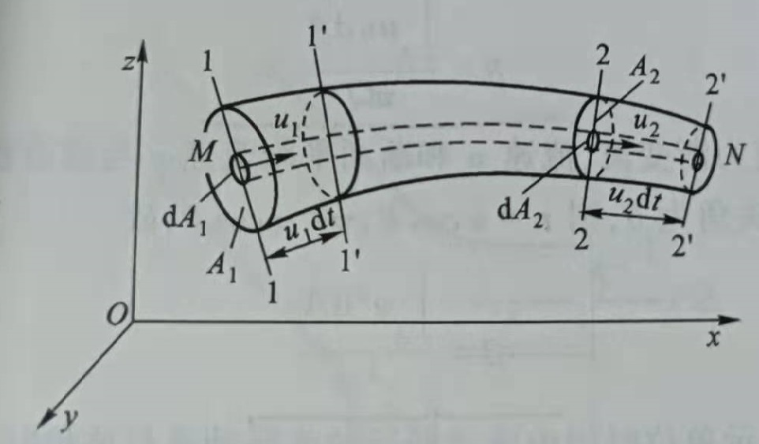

在恒定总流中取微小流束段，两端过水断面为 $1-1$ 和 $2-2$；经微小时段 $dt$，原流段 $1-2$   
移至新的位置 $1' - 2'$。  
断面 $1-1$ 面积为 $dA_1$，流速为 $u_1$；断面 $2-2$ 面积为 $dA_2$，流速为 $u_2$。  

流段 $1-2$ 流至 $1' - 2'$，流段内动量的变化：  

$$\Delta \textbf{p} = \textbf{p}_{1'-2'} - \textbf{p}_{1-2} \\
\textbf{p}_{1'-2'} = \textbf{p}_{1'-2} + \textbf{p}_{2-2'} ,\quad \textbf{p}_{1-2} = \textbf{p}_{1-1'} + \textbf{p}_{1'-2}  \tag{1-11}$$

其中，$\textbf{p}_{1'-2}$ 实际是处于不同时刻下流段 $1'-2$ 具有的动量。但在恒定流中，  
流段 $1'-2$ 的形状、质量、流速不变：  

$$\Delta \textbf{p} = \textbf{p}_{2-2'} - \textbf{p}_{1-1'}  \\
\textbf{p}_{1-1'} = \int_{A_1} \textbf{u}_1 \rho u_1 \mathrm{d} t \mathrm{d} A_1 = \rho \mathrm{d} t \int_{A_1} \textbf{u}_1 u_1 \mathrm{d} A_1  ,\quad  \textbf{p}_{2-2'} = \rho \mathrm{d} t \int_{A_2} \textbf{u}_2 u_2 \mathrm{d} A_2 \tag{1-12}$$

采用断面平均流速 $v$ 替代 $u$，通过动量修正系数 $\beta$ 修正误差：

$$\textbf{p}_{1-1'} = \rho \mathrm{d} t \beta_1  \int_{A_1} \textbf{v}_1 u_1 \mathrm{d} A_1  = \rho \mathrm{d} t \beta_1 \textbf{v}_1 Q_1 ,\quad \textbf{p}_{2-2'} = \rho \mathrm{d} t \beta_2  \int_{A_2} \textbf{v}_2 u_2 \mathrm{d} A_2 \tag{1-13}$$

如果断面上为渐变流，则断面实际流速 $u$ 和平均流速 $v$ 与动量投影轴的夹角 $\theta$ 可以认为相等；  
$u_i = u \cos \theta ,\quad v_i = v \cos \theta$ ；  
**动量修正系数** $\beta = \frac{\int_{A} \textbf{u} u \mathrm{d} A}{\textbf{v} Q} = \frac{\int_{A} u^2 \mathrm{d} A}{v^2 A} \geq 1.0$，流速分布均匀，其值越小；  
对于渐变流，$\beta = 1.02 \sim 1.05$。

若令 $\Sigma \textbf{F}$ 为 $dt$ 时段内作用于总流流段上所有外力的冲量和，由动量定律，  
则可以得到 **恒定总流的动量方程**： 

$$\rho Q (\beta_2 \textbf{v}_2 - \beta_1 \textbf{v}_1) = \Sigma \textbf{F} \tag{1-14}$$

其中控制体是任意选取的，一般取整个总流的边界为控制体边界；左端动量项为输出减输入。

*------------------ * ------------------*

对于过水断面间有流量进出的情况，例如存在汇合水流，恒定总流的守恒方程需要加以修正。

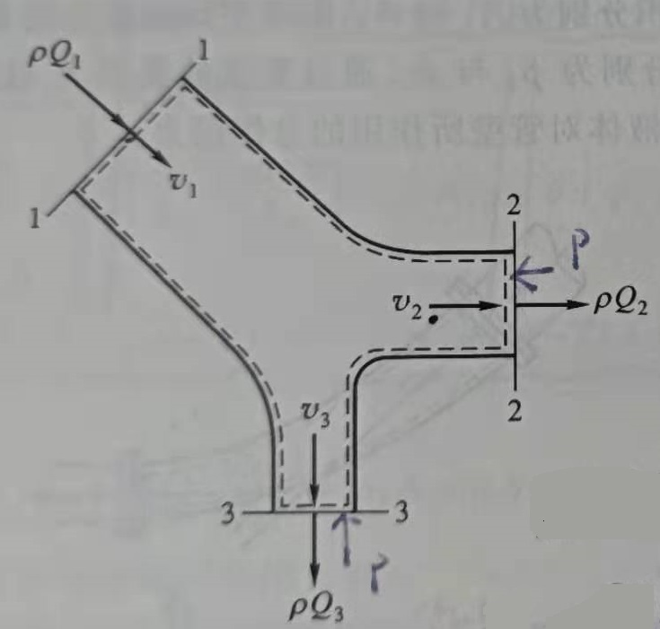

存在两支汇合水流，每支流量分别是 $Q_1$ 和 $Q_2$，流速分别是 $v_1$ 和 $v_2$；根据能量守恒定律，  
控制体上输入的总能量应当等于输出的总能量加上能量损失： 

$$\rho g Q_1 (z_1 + \frac{p_1}{\rho g} + \frac{\alpha_1 v_{1}^{2}}{2 g}) + \rho g Q_2 (z_2 + \frac{p_2}{\rho g} + \frac{\alpha_2 v_{2}^{2}}{2 g})  = \\
\rho g Q_3 (z_3 + \frac{p_3}{\rho g} + \frac{\alpha_3 v_{3}^{2}}{2 g}) + \rho g Q_1 h_{w1-3} + \rho g Q_2 h_{w2-3} \space \tag{1-15}$$

恒定流中，控制体的形状、质量、速度不随时间变化，故 $Q_3 = Q_2 + Q_1$，代入整理得到： 

$$Q_1[(z_1 + \frac{p_1}{\rho g} + \frac{\alpha_1 v_{1}^{2}}{2 g}) - (z_3 + \frac{p_3}{\rho g} + \frac{\alpha_3 v_{3}^{2}}{2 g}) - h_{w1-3}] + \\
Q_2[(z_2 + \frac{p_2}{\rho g} + \frac{\alpha_2 v_{2}^{2}}{2 g}) - (z_3 + \frac{p_3}{\rho g} + \frac{\alpha_3 v_{3}^{2}}{2 g}) -  h_{w2-3}] = \\
0 \tag{1-16}$$

左端项每一项表示一支水流的输入与输出总能量之差，因此两项均为非负；  
方程成立要求各自为 0。  
$$\begin{cases}
z_1 + \frac{p_1}{\rho g} + \frac{\alpha_1 v_{1}^{2}}{2 g} = z_3 + \frac{p_3}{\rho g} + \frac{\alpha_3 v_{3}^{2}}{2 g} + h_{w1-3} \\
  \\
z_2 + \frac{p_2}{\rho g} + \frac{\alpha_2 v_{2}^{2}}{2 g} = z_3 + \frac{p_3}{\rho g} + \frac{\alpha_3 v_{3}^{2}}{2 g} + h_{w2-3}
\end{cases}  \tag{1-17}
$$
  
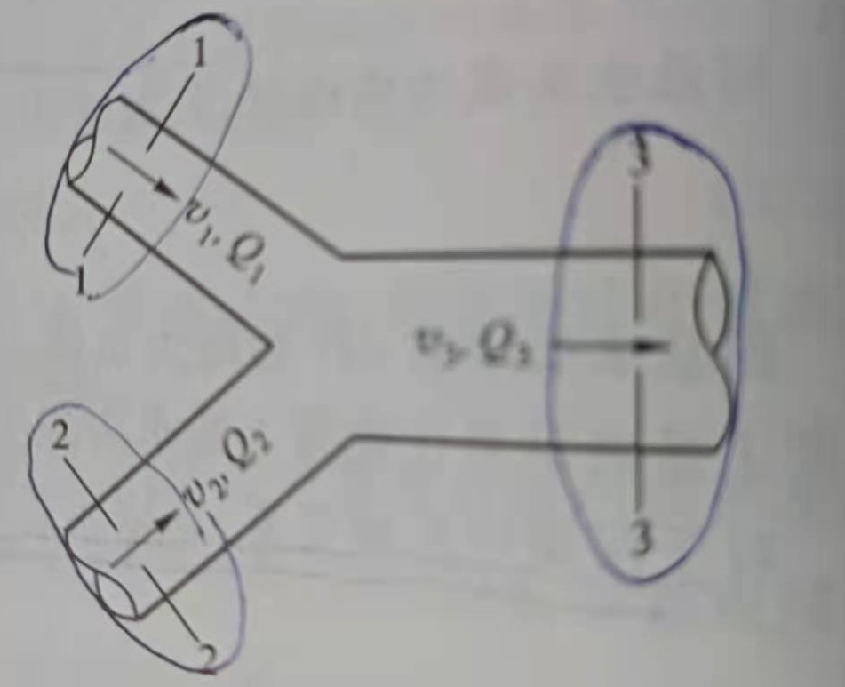

存在两支分叉水流，每支流量分别是 $Q_1$、$Q_2$ 和 $Q_3$，断面平均流速分别是 $v_1$、$v_2$ 和 $v_3$；  
控制体上动量方程：  

$$\rho Q_2 \beta_2 \textbf{v}_2 + \rho Q_3 \beta_3 \textbf{v}_3 - \rho Q_1 \beta_1 \textbf{v}_1 = \Sigma \textbf{F} \tag{1-18}$$

[<i class="fa fa-home"></i>](#圣维南方程组)

*--- 补充：---* 

1. 理想流体，是指不可压缩、不可膨胀、没有粘滞性、没有表面张力的连续介质。

2. 流体压缩性以 **体积压缩率$\kappa$** 或 **体积模数$K$** 表征，$K = \frac{1}{\kappa} = \frac{\rho \mathrm{d} p}{\mathrm{d} \rho}$；  
对于水，$K_{10℃} = 2.9 \times 10^9 (P_a)$。

3. 能量方程要求两个过水断面上为渐变流，但不要求断面之间的水流也是渐变流。

4. 总水头沿程的降低值与流程之比，称为总水头坡度，也称**水力坡度**：  
$J = \frac{H_{up} - H_{dn}}{L} = \frac{h_w}{L}$。

5. 明渠水流控制体边界，一般既有底部和侧壁的固体边界，也会有自由水面边界，  
横向边界一般取过水断面。

---------------------------------------------------------------------------

## 明渠恒定均匀流

*Steady Uniform Open Channel Flow*

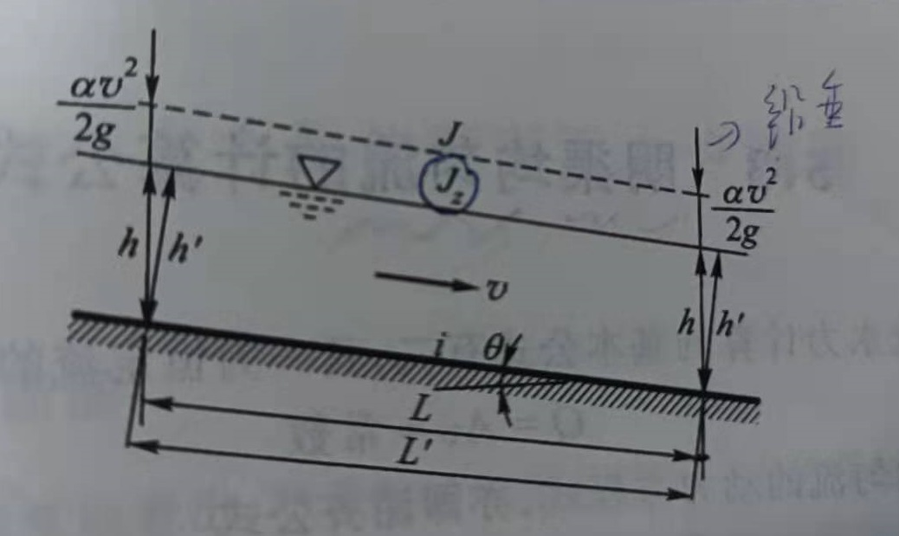

在明渠恒定流中，如果流线是一簇平行直线，则断面水深、断面平均流速及流速分布均沿程不变，  
称为**明渠均匀流**。

具有运动学特性：

1. 过水断面上的流速分布、平均流速沿程不变（因此动能修正系数及流速水头沿程不变）；
2. 过水断面的形状、尺寸及水深沿程不变；
3. 水流的总水头线、水面线及底坡线三者相互平行，即 $J = J_z = i$。

具有动力学特性： 

1. 水流运动中所受的周界摩阻力与水流重力在流动方向的分力相平衡；
2. 明渠均匀流实际上是一种受力达到平衡状态下产生的匀速直线运动。

产生的必要条件：  
1. 要求断面形状、尺寸及底坡均沿程不变且没有弯曲的棱柱体顺坡明渠，糙率沿流程不变；
2. 流量应该沿程不变，即无支流的汇入或流出；
3. 水流必须是恒定流（否则必然伴随波浪的产生，进而流线不可能平直）；
4. 渠道中无闸、坝或跌水等构筑物的局部干扰。

明渠均匀流运动方程：$Q = A v = const$，动力方程(**谢齐公式**)：$v = C \sqrt{R J} = C \sqrt{R i}$；  
明渠均匀流的流量方程：$Q = A C \sqrt{R i} = K \sqrt{i}$。

其中，C 为谢齐系数，明渠水流多处于**阻力平方区**故常用**曼宁公式**或**巴甫洛夫斯基公式**计算；  
K 为流量模数，综合反映明渠的断面形状、尺寸和粗糙程度对过水能力的影响。

[<i class="fa fa-home"></i>](#圣维南方程组)

*--- 补充：---* 

1. 曼宁公式，$C = \frac{1}{n} R^{\frac{1}{6}}$，糙率 n 对 C 具有主要影响；  
巴甫洛夫斯基公式，$C = \frac{1}{n} R^y, y=2.5\sqrt{n} - 0.13 - 0.75\sqrt{R} (\sqrt{n} - 0.1)$ 。 

---------------------------------------------------------------------------

## 明渠恒定非均匀流

*Steady non-Uniform Open Channel Flow*

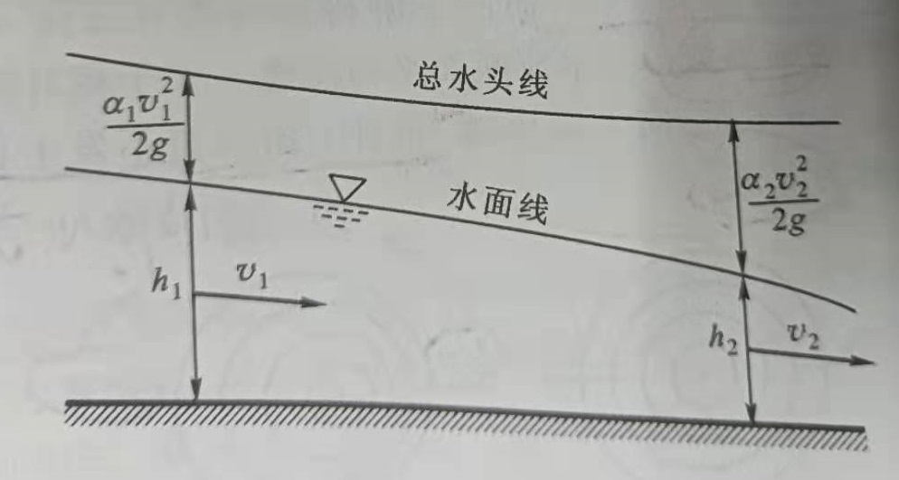

明渠恒定非均匀流中，明渠的底坡线、水面线、总水头线彼此不平行。  
与均匀流不同，非均匀流水深沿流程变化 $h = f(s)$；作为对比，将均匀流水深称为**正常水深 $h_0$**。

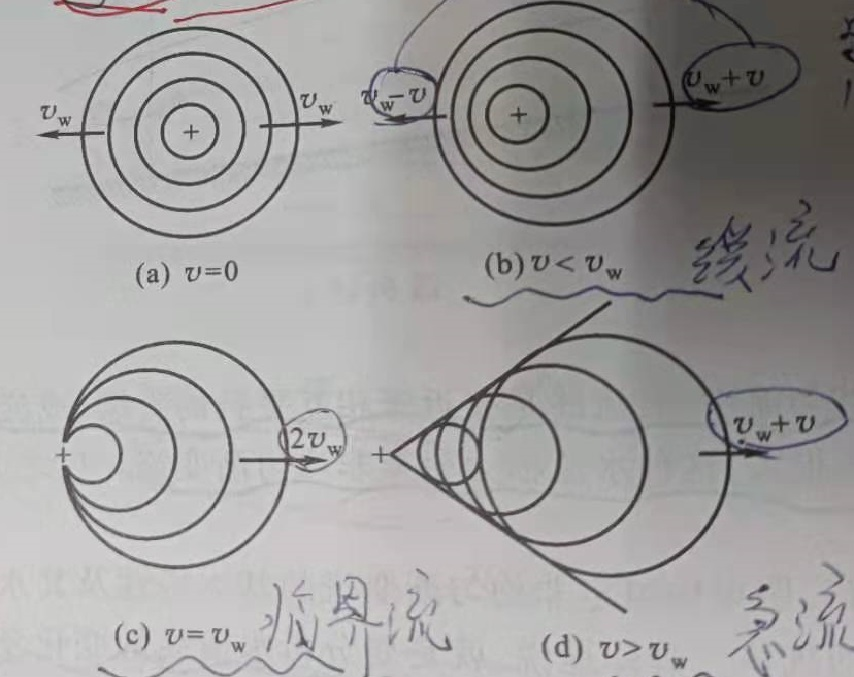

若在静水中某点处产生一个微小波动，以速度$v_w$向四周传播，平面上的波形将是一连串的同心圆。  
这种静水中传播的微波速度 $v_w$ 称为 **相对波速**。 

若在动水中某点处产生一个微小波动，则微波的**绝对传播速度**应是水流流速与相对波速的矢量和。 
动水中，若断面流速$v < v_w$，则微波将以绝对速度$v-v_w$ 向上游传播、以$v + v_w$ 向下游传播，   
这种水流称为**缓流**；   
动水中，若断面流速 $v = v_w$，则微波将以绝对速度 $0$ 向上游传播、同时以 $v+ v_w$ 向下游传播，  
这种水流为 **临界流**。  
动水中，若断面流速 $v > v_w$，则微波将只能以绝对流速 $v + v_w$ 向下游传播，而对上游无影响，   
这种水流称为 **急流**。

*------------------ * ------------------*

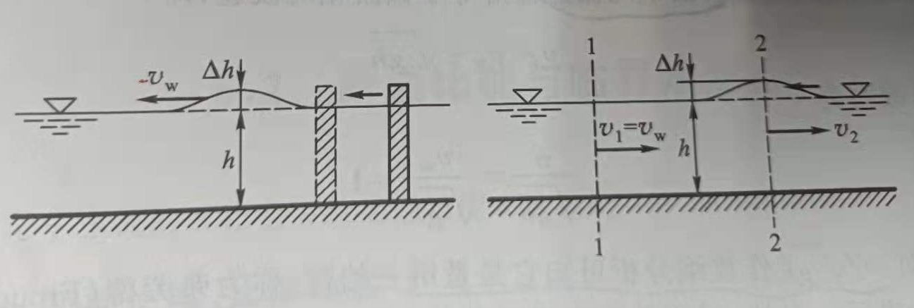

在平底矩形棱柱体明渠静止水流当中，假设水深为 $h$；初始时刻，  
右边界激起一个微小波动，波高为 $Δh$，波速 $v_w$ 向左移动。建立伴随微波移动的**移动坐标系**，  
此时，水流在坐标系中呈现恒定非均匀流运动，以流速 $v_w$ 向右移动，而同时微波则静止不动。  

假设忽略摩擦阻力，以水平渠底为基准面，对相距很近的断面 $1-1$ 和 $2-2$ 建立守恒方程：

$$h v_w = (h + \Delta h) v_2  \quad and \quad
h + \frac{\alpha_1 v_{w}^2}{2 g} = h + \Delta h + \frac{\alpha_2 v_{2}^2}{2g}  \tag{3-1}$$

令断面动能修正系数均为1.0、波高远小于水深，得到**矩形平底明渠静水微波的相对波速公式**： 
$$\begin{aligned}
&If: \quad \alpha_1 = \alpha_2 = 1.0, \quad \Delta h \ll h  \\
&Then: \quad  v_w = \sqrt{gh}
\end{aligned} \tag{3-2}$$

进一步的，任意断面形状的明渠静水中微波的相对波速公式：$v_w = \sqrt{g \bar{h}}$。  
进一步的，$\bar{h} = \frac{A}{B}$, 其中 $\space B$为水面宽度。
 
采用 **弗劳德数$F_r$** 表征流态，即水流平均动能与平均势能比值，即水流惯性力和重力的比值：  
$$F_r = \frac{v}{\sqrt{g \bar{h}}} = \sqrt{2 \frac{\frac{v^2}{2g}}{\bar{h}}} \quad or \quad F_r = \sqrt{\frac{F}{G}} = \frac{v}{\sqrt{g L}} \tag{3-3}$$

+ 当 Fr < 1 时，水流为缓流，平均势能占比更大；惯性力小于重力，重力主导水流运动；  
+ 当 Fr = 1 时，水流为临界流，平均势能与平均动能的占比相等；惯性力作用等于重力；
+ 当 Fr > 1 时，水流为急流，平均动能的占比更大；惯性力大于重力，惯性力主导流动。

*------------------ * ------------------*

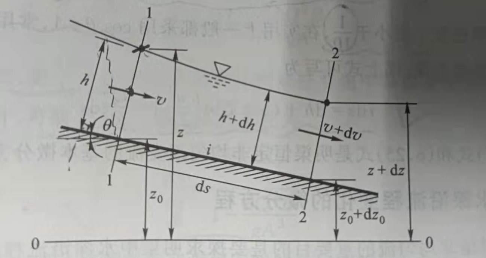

在底坡为 $i$ 的明渠渐变流中，沿水流方向任取一微分流段 $ds$；上游断面 $1-1$ 水力要素为  
$h、z、v、z_0$；下游断面 $2-2$ 水力要素为 $h + dh、z + dz、v + dv、z_0 + dz_0$。  

联合明渠恒定渐变流的上、下游断面以建立能量方程： 

$$\begin{aligned}
z_0 + h \cos \theta + \frac{\alpha_1 v^2}{2g} &= (z_0 - i \mathrm{d}s) + (h + \mathrm{d}h) \cos \theta + \frac{\alpha_2 (v + \mathrm{d}v)^2}{2g} \\
&+ \mathrm{d} h_f + \mathrm{d} h_j
\end{aligned}  \tag{3-4}$$

为了分析上述方程，对方程中各项作以下的处理：  
1. 令 $\alpha_1 = \alpha_2 = \alpha$，同时忽略高阶小量 ；
2. 令 微段内局部水头损失 $\mathrm{d} h_j \approx \zeta \mathrm{d} (\frac{v^2}{2g})$；
3. 令 cos θ = 1.0，如果明渠底坡值 i < 0.1 ；
3. 令 非均匀流的沿程水头损失 $\mathrm{d} h_f \approx \frac{Q^2}{K^2} \mathrm{d}s = \frac{v^2}{C^2 R} \mathrm{d}s$，即采用均匀流公式作近似计算；

从而可以得到**明渠恒定非均匀渐变流的基本微分方程**：  

$$i \mathrm{d}s = \cos \theta \mathrm{d}h + \mathrm{d} (\frac{\alpha v^2}{2g}) + \mathrm{d} h_f + \mathrm{d} h_j  = \mathrm{d}h + (\alpha + \zeta) \mathrm{d} (\frac{v^2}{2g}) + \frac{Q^2}{K^2} \mathrm{d}s  \tag{3-5}
$$

*------------------ * ------------------*

对于天然河道，$z = z_0 + h cos θ$，从而 $dz = dz_0 + dhcos θ$，因而 $dhcos θ = dz + i ds$；  
代入方程$(3-5)$整理，  
从而可得到**明渠恒定非均匀渐变流的水面线微分方程**：  

$$-\frac{\mathrm{d} z}{\mathrm{d} s} =(\alpha + \zeta) \mathrm{d} (\frac{v^2}{2g}) + \frac{Q^2}{K^2} \tag{3-6}$$

方程适用棱柱体及非棱柱体明渠，一般用于天然河道。

对于底坡较小的明渠非均匀渐变流（忽略底坡对水深计算的影响），水深沿流程的变化规律：

$$i - \frac{Q^2}{K^2} = \frac{\mathrm{d}h}{\mathrm{d} s} + (\alpha + \zeta) \frac{\mathrm{d}}{\mathrm{d} s} (\frac{v^2}{2g}) \tag{3-7}$$

其中，  
$$\begin{cases}
\frac{\mathrm{d}}{\mathrm{d} s} (\frac{v^2}{2g}) = \frac{\mathrm{d}}{\mathrm{d} s} (\frac{Q^2}{2g A^2}) = - \frac{Q^2}{g A^3} \frac{\mathrm{d} A}{\mathrm{d} s}  \\
  \\
\frac{\mathrm{d} A}{\mathrm{d} s} = \frac{\partial A}{\partial h} \frac{\mathrm{d}h}{\mathrm{d} s} + \frac{\partial A}{\partial s}, \quad \frac{\partial A}{\partial s} = B
\end{cases} \tag{3-8}$$

得到非棱柱体明渠非均匀渐变流的水深沿程变化规律：  

$$\frac{\mathrm{d}h}{\mathrm{d} s} = \frac{i - \frac{Q^2}{K^2} + (\alpha + \zeta) \frac{Q^2}{g A^3} \frac{\partial A}{\partial s}}{1 - (\alpha + \zeta) \frac{Q^2 B}{g A^3}} \tag{3-9}$$

棱柱体明渠中$\frac{\partial A}{\partial s} = 0$，忽略棱柱体渐变流局部水头损失；可得**棱柱体明渠渐变流水深方程**：  
 
$$\frac{\mathrm{d}h}{\mathrm{d} s} = \frac{i - \frac{Q^2}{K^2}}{1 - \frac{\alpha Q^2 B}{g A^3}}  \tag{3-10}$$ 

方程用于分析棱柱体明渠恒定渐变流水面线的变化。

*------------------ * ------------------*

明渠非均匀流存在两种特殊流动：弯道水流和水跃：    
**弯道水流**，水流在弯道处受离心惯性力，因径向和竖向流速、在纵向流速外产生的次生副流。   
弯道水流中纵向流动和副流叠加在一起构成螺旋流。  
**水跃**，明渠中水流由急流过渡到缓流状态时，产生的一种水面突然跃起的特殊局部水力现象。

[<i class="fa fa-home"></i>](#圣维南方程组)

---------------------------------------------------------------------------

## 非恒定流基本方程组

*The Basic Equations of Unsteady Flow*

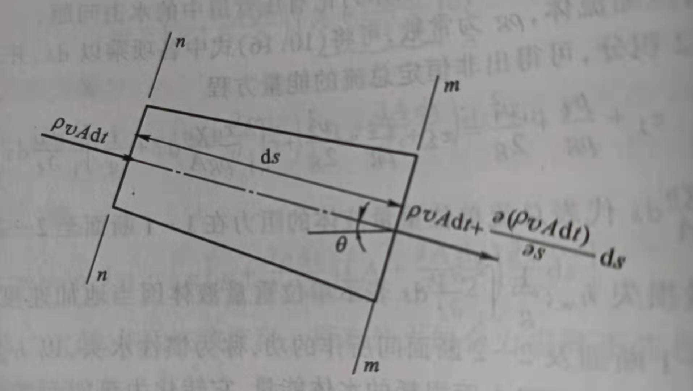

在非恒定水流中取出长度为 $ds$ 的微分流段作为控制体，两端断面为 $n-n、m-m$。  
设 $n-n$ 断面的面积为 $A$，流速为 $v$，水流密度为 $\rho$。  

在 $dt$ 时段内，流段上  
通过 $n-n$ 断面流入控制体的水体质量为 $\rho v A \mathrm{d}t$，通过 $m-m$ 断面流出的水体质量  
为 $\rho v A \mathrm{d}t + \frac{\partial}{\partial s}(\rho v A \mathrm{d}t) \mathrm{d}s$；根据质量守恒，可得到， 

$$\rho v A \mathrm{d}t - [\rho v A \mathrm{d}t + \frac{\partial}{\partial s}(\rho v A \mathrm{d}t) \mathrm{d}s] = \frac{\partial}{\partial t}(\rho A \mathrm{d}s) \mathrm{d}t \tag{4-1}$$

**非恒定流的连续方程**：  

$$\frac{\partial}{\partial t}(\rho A) + \frac{\partial}{\partial s}(\rho v A) = 0 \tag{4-2}$$

上述方程同时适用于压力管道非恒定流、弹性管壁压力管道非恒定流以及明渠非恒定流；  
适用可压缩**水击**水流。

对于明渠**不可压缩**非恒定流，进一步整理可以得到：  

$$\frac{\partial A}{\partial t} + \frac{\partial v A}{\partial s} = \frac{\partial A}{\partial t} + \frac{\partial Q}{\partial s} = \frac{\partial A}{\partial t} + v \frac{\partial A}{\partial s} + A \frac{\partial v}{\partial s}=0 \tag{4-3}$$

如果 $\frac{\partial Q}{\partial s} < 0$，则有 $\frac{\partial A}{\partial t} > 0$，流量流入多于流出，区间内水位将上升从而产生涨水波；  
反之，产生落水波。

对不考虑管壁弹性的管道非恒定流，流量沿程不变：

$$v A = f(t) \tag{4-4}$$

上述方程表明，管道内非恒定流的断面流量只随时间变化，在同一时刻下流量沿程不变。

*------------------ * ------------------*

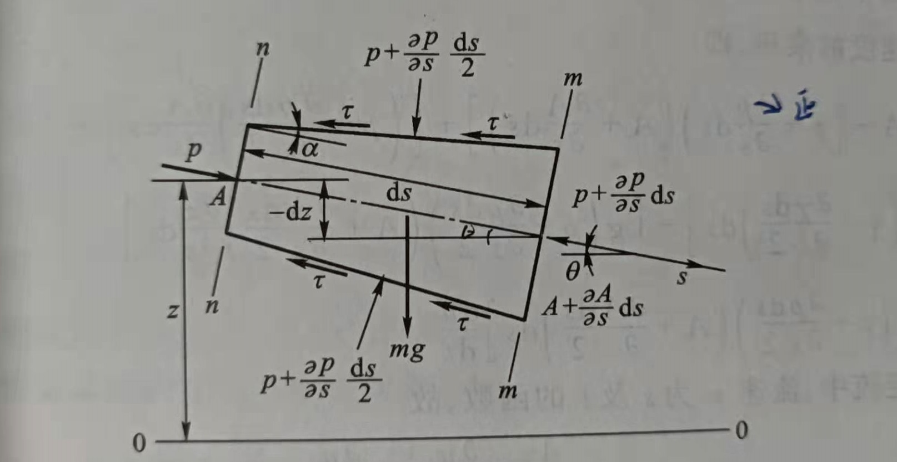

在明渠非恒定流中任取长度为 $ds$ 的微小流束，$s$ 轴取与恒定流时水流方向一致的方向，  
$s$ 轴线与水平线夹角为 $θ$。  
断面 $n-n$ 上密度为 $\rho$，过水面积为 $A$，湿周为 $\chi$，压强为 $p$；  
断面 $m-m$ 上密度为 $\rho + \frac{\partial \rho}{\partial s}\mathrm{d}s$，过水面积为 $A + \frac{\partial A}{\partial s}\mathrm{d}s$，过水湿周为 $\chi + \frac{\partial \chi}{\partial s}\mathrm{d}s$，  
静水压强值为 $p + \frac{\partial p}{\partial s}\mathrm{d}s$。

应用牛顿第二定律，分析微小流束上沿 $s$ 方向的受力情况如下：

1. 水压力,平行 $s$ 轴侧壁 $(p + \frac{\partial p}{\partial s} \frac{\mathrm{d}s}{2})(\frac{\partial A}{\partial s}\mathrm{d}s)$，垂直 $s$ 轴截面  $\{pA - (p + \frac{\partial p}{\partial s}\mathrm{d}s)(A + \frac{\partial A}{\partial s}\mathrm{d}s)\}$；

2. 粘阻力,平行 $s$ 轴  $-\tau (\chi + \frac{\partial \chi}{\partial s} \frac{\mathrm{d}s}{2})\mathrm{d}s · \cos \alpha$，$\tau$ 为单位周界面上的平均阻力，$\cos \alpha$ 一般为1.0；

3. 质量力,平行 $s$ 轴$(\rho + \frac{\partial \rho}{\partial s} \frac{\mathrm{d}s}{2})(A + \frac{\partial A}{\partial s}\frac{\mathrm{d}s}{2}) g \mathrm{d}s \cdot \sin \theta = (\rho + \frac{\partial \rho}{\partial s} \frac{\mathrm{d}s}{2})(A + \frac{\partial A}{\partial s}\frac{\mathrm{d}s}{2}) g \mathrm{d}s (- \frac{\partial z}{\partial s})$。

流段流体受力分析如下： 

$$\sum F = (\rho + \frac{\partial \rho}{\partial s} \frac{\mathrm{d}s}{2})(A + \frac{\partial A}{\partial s}\frac{\mathrm{d}s}{2}) g \mathrm{d}s \cdot \frac{\mathrm{d} v}{\mathrm{d} t} \quad and \quad \frac{\mathrm{d} v}{\mathrm{d} t} = \frac{\partial v}{\partial t} + v \frac{\partial v}{\partial s} \tag{4-5}$$

整理得到 **微小流束非恒定流的运动方程**：  
 
$$\frac{\partial}{\partial s}(z + \frac{p}{\rho g} + \frac{v^2}{2g}) = - \frac{\tau \chi}{\rho g A} - \frac{1}{g} \frac{\partial v}{\partial t} \tag{4-6}$$

假设总流为渐变流，并对整个总流过水断面积分，略去断面上流速分布不均匀的影响，  
得到 **非恒定总流的运动方程**：   

$$\frac{\partial}{\partial s}(z + \frac{p}{\rho g} + \frac{v^2}{2g}) = - \frac{\tau_0 \chi_0}{\rho g A} - \frac{1}{g} \frac{\partial v}{\partial t} \tag{4-7}$$

其中，$z, p, v$ 分别为总流断面的平均高程、压强以及流速；$A$ 过水面积；$\chi_0$ 为湿周；  
$\tau_0$ 为断面周界上平均切应力。 

*------------------ * ------------------*

对于不可压缩水流，$\rho g$ 为常数，将方程各项乘以 $ds$，从断面 $1-1$ 至 $2-2$ 积分，  
得到 **非恒定总流的能量方程**：

$$z_1 + \frac{p_1}{\rho g} + \frac{{v_1}^2}{2g} = z_2 + \frac{p_2}{\rho g} + \frac{{v_2}^2}{2g} + \int_{1}^{2} \frac{\tau_0 \chi_0}{\rho g A} \mathrm{d}s + \frac{1}{g} \int_{1}^{2} \frac{\partial v}{\partial t} \mathrm{d}s \tag{4-8}$$

其中，  
+ $\int_{1}^{2} \frac{\tau_0 \chi_0}{\rho g A} \mathrm{d}s$，代表总流单位质量水流从断面 $1-1$ 流至断面 $2-2$ 阻力做的功，即**内能耗散** $h_f$；  
+ $\int_{1}^{2} \frac{\partial v}{\partial t} \mathrm{d}s$，为单位质量水流从 $1-1$ 流至 $2-2$ 当地加速度 $\frac{\partial v}{\partial t}$ 的惯性力做功，即**惯性水头** $h_a$。

[<i class="fa fa-home"></i>](#圣维南方程组)

*--- 补充：---*   

1. 上述推导未考虑微分时段 $dt$ 内 $\rho, A, \chi, p$ 的变化，加入考虑、略去高阶项，推导结果不变。

2. 分析受力时侧面积计算采用平均面积 $A + \frac{\partial A}{\partial s}\frac{\mathrm{d}s}{2}$；密度、压力、湿周、阻力也采用平均值。

---------------------------------------------------------------------------

## 明渠非恒定渐变流

*Unsteady Gradually Varied Open Channel Flow*

+ 明渠非恒定流必是非均匀流，水力要素是时间$t$ 和流程$s$ 的函数，$f = f(s,t)$。
+ 明渠非恒定流也是波动现象。
+ 明渠非恒定流所流经区域内各过水断面水位流量关系一般不是单一稳定的关系。

外界扰动产生的波动使水体质点基本循着一定轨迹（圆或椭圆）往复运动，几乎没有流量传递，  
只是同方向各处质点运动彼此相差一个相位而形成的水面波形的推进，称为 **振动波** 或 **推进波** 。

对于明渠非恒定流的波动，其是由于在非恒定流明渠的某一位置流量和水位发生改变而形成的，  
以重力、通过水流质点的位移形成波的传播，在波所流经区域内会引起当地流量和水位的变化，  
称为 **变位波**。

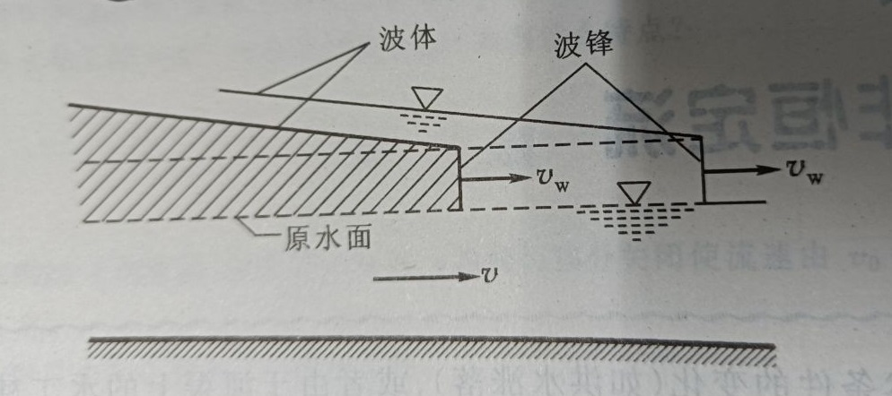

明渠非恒定流的波有两部分：**波峰** 和 **波体**。波峰推进速度 $v_w$ 为 **波速**，$v$ 为断面平均流速。

从明渠非恒定流的水力要素随时间变化的急剧程度划分， 

+ **连续波**，即 **非恒定渐变流**，要素变化平缓，波高相对波长很小，水流瞬时流线近乎平行直线；
+ **间断波**，即 **非恒定急变流**，要素变化剧烈，波高较大，波峰处水面很陡、要素不再是连续的。

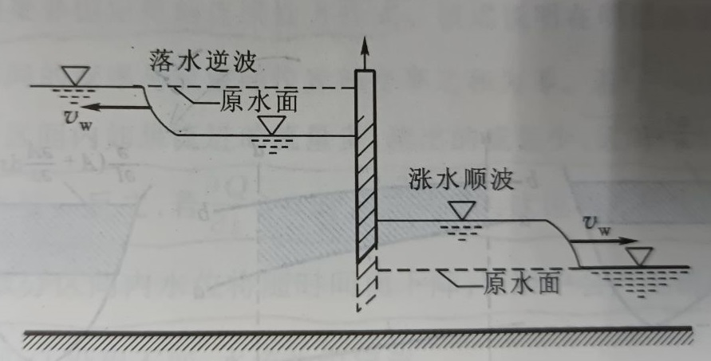
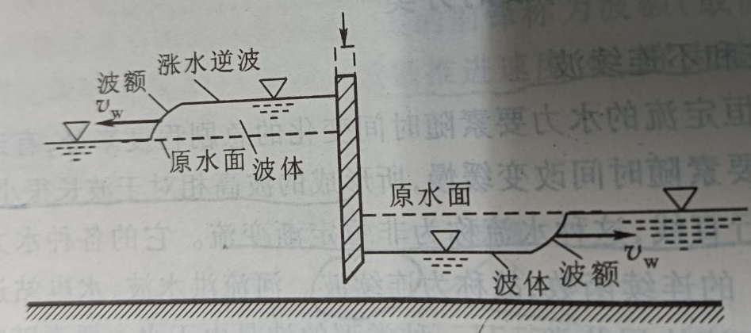

**涨水波**，当波到达后引起明渠水位抬高；**落水波**，当波到达后引起明渠水位下降。  
**顺波**，波的传播方向与水流方向一致；反之，则为 **逆波**。  

如快速开启明渠水闸，下游流量增加，致下游水位迅速上涨，形成涨水顺波向下游传播；  
上游因泄流增加，水位下降，有落水逆波向上传播。  
如快速关闭明渠水闸，上游产生涨水逆波向上游传播，下游将产生落水顺波向下游传播。

*------------------ * ------------------*

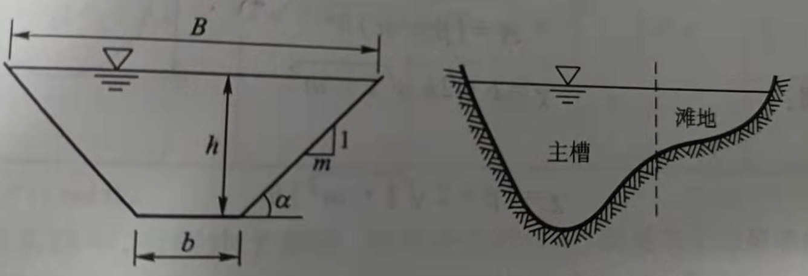

对于明渠非恒定渐变流，压力项消失，从而可以得到 **明渠非恒定渐变总流的运动方程**，  
又称为 **圣维南方程**：

$$-\frac{\partial z}{\partial s} = \frac{\partial h_f}{\partial s} + \frac{1}{g} \frac{\partial v}{\partial t} + \frac{v}{g}\frac{\partial v}{\partial s} \tag{5-1}$$
 
+ $-\frac{\partial z}{\partial s}$，表示**水面坡度** $J$，代表单位重量流体的势能沿程的变化率；
+ $\frac{1}{g} \frac{\partial v}{\partial t}$，表示**波动坡度** $J_w$，代表当地加速度作用在单位重量流体上产生的惯性力沿单位流程做功；  
+ $\frac{v}{g}\frac{\partial v}{\partial s}$，表示**动能坡度** $J_v$，单位重量流体动能沿程的变化率 (即迁移加速度的惯性力沿流程做功) ；    
+ $\frac{\partial h_f}{\partial s}$，表示**摩阻坡度**（即水力坡度）$J_f$，单位重量流体沿着单位流程为克服摩擦阻力所作的功 。

因而，运动方程可以转化表示为能量关系：  
$$J = J_w + J_v + J_f$$

方程表明能量守恒：  
明渠非恒定流中势能沿着流程的改变，将用于克服阻力做功和转化为加速度而做功。

将摩阻坡度近似按恒定均匀流计算，得到：

$$J_f = \frac{\partial h_f}{\partial s} = \frac{Q^2}{K^2} = \frac{v^2}{C^2 R} \tag{5-2}$$

进一步假设，如果明渠底高程为 $z_0$，水深为 $h$，底坡为 $i$，则有关系 $z = z_0 + h$，  
从而可得到$\frac{\partial z}{\partial s} = \frac{\partial z_0}{\partial s} + \frac{\partial h}{\partial s} = -i + \frac{\partial h}{\partial s}$。  

圣维南方程的变形，得到：  

$$i - \frac{\partial h}{\partial s} = \frac{\partial h_f}{\partial s} + \frac{1}{g} \frac{\partial v}{\partial t} + \frac{v}{g}\frac{\partial v}{\partial s} \tag{5-3}$$

但是实际上$z - z_0 = h \cos \theta$，上述方程要求明渠底坡 $i$ 为缓坡（$\cos \theta \approx 1.0$）。

明渠缓坡渐变流圣维南方程组所描述的非恒定水流是一种 **浅水** 中的长波传播现象，  
通常称之为 **动力波**。  
忽略动力波的惯性项和压力项，只考虑摩阻和底坡，简化后描述的运动称为**运动波**；  
如果只忽略惯性项，则简化后所描述的运动称为**扩散波**；  
如果只忽略摩阻项，则简化后所描述的运动称为**惯性波**。

+ 运动波方程，$i = \frac{\partial h_f}{\partial s}$；
+ 扩散波方程，$i - \frac{\partial h}{\partial s} = \frac{\partial h_f}{\partial s}$；
+ 惯性波方程，$i - \frac{\partial h}{\partial s} = \frac{1}{g} \frac{\partial v}{\partial t} + \frac{v}{g}\frac{\partial v}{\partial s}$。

对于明渠恒定流，因为 $J_w = 0$，可得到 **明渠恒定非均匀渐变流的基本微分方程**：

$$-\frac{\mathrm{d} z}{\mathrm{d} s} = \frac{\mathrm{d} h_f}{\mathrm{d} s} + \frac{v}{g} \frac{\mathrm{d} v}{\mathrm{d} s} \tag{5-4}$$

对于明渠恒定均匀流，进一步的有 $J_v = 0$，从而可以得到 **明渠恒定均匀流公式**：  
$$-\frac{\mathrm{d} z}{\mathrm{d} s} = \frac{\mathrm{d} h_f}{\mathrm{d} s} = J_f \quad or \quad J_f = \frac{Q^2}{K^2} \tag{5-5}$$

明渠恒定均匀流是因阻力和重力平衡，动能保持不变，水头损失来自势能的减少；  
因此，其摩阻坡度等于底坡。  

[<i class="fa fa-home"></i>](#圣维南方程组)

*--- 补充：---* 

1. 压力管道中非恒定流波靠压力差传播，明渠中非恒定流波靠重力传播。

2. 对于不连续波，波峰处水面很陡、水力要素不连续，但波体部分仍可以近似看作渐变流。

---------------------------------------------------------------------------

## 明渠非恒定急变流

*Unsteady Rapidly Varied Open Channel Flow*

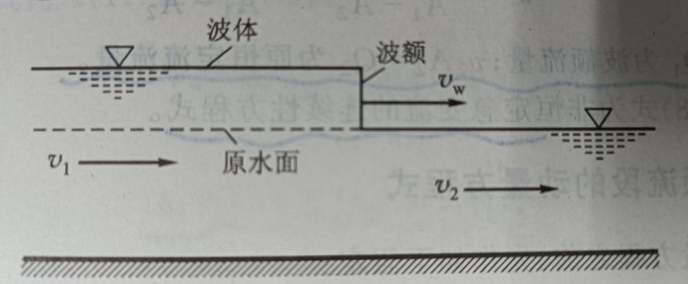

对于明渠非恒定急变流，由于波峰附近水流突变，所以波峰段不再满足渐变流方程。   
假定波峰移动过程中，波峰坡面垂直原水面；波峰质点平均速度为 $v_w$ 并在波的推进中保持不变。

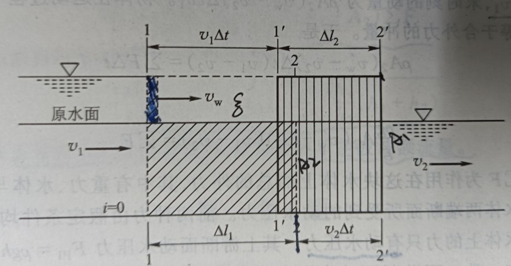

在非恒定波中取出长度为 $Δl_1 = (v_w - v_2)Δt$ 的水体，  
假设初始时刻，过水断面 $1-1、2-2$ 上平均流速分别为 $v_1、v_2$；经过 $Δt$ 时段，  
水体运动到位置 $1'-1'、2'-2'$。

初始时刻，水体体积为 $ A_2 \Delta l_1 = A_2 (v_w - v_2) \Delta t$； 
运动末期，水体体积为 $ A_1 \Delta l_2 = A_1 (v_w - v_1) \Delta t$。  

对于不可压缩流体，水体体积在初、末时刻不变，得到 **非恒定急变流的连续性方程**： 

$$A_1 v_1 = v_w (A_1 - A_2) + A_2 v_2 \quad or \quad v_w = \frac{A_1 v_1 - A_2 v_2}{A_1 - A_2} = \frac{Q_1 - Q_2}{A_1 - A_2} \tag{6-1}$$
 
$A_1, A_2$ 分别为波峰和原水体断面积；$Q_1 = A_1 v_1$ 为波峰流量，$Q_2 = A_2 v_2$ 为原恒定流流量。

*------------------ * ------------------*

1. 假定河渠的底坡甚小，重力沿底坡方向分力很小从而忽略；
2. 由于波峰流动段不长，水流与槽壁间摩阻力很小从而忽略；

以上假定下，初始时刻水体平均速度为 $v_2$，末期水体的平均速度为 $v_1$，波峰水体的受力情况：  

在初始时刻，波峰水体动量为 $v_1 \cdot \rho A_2 (v_w - v_2) \Delta t$;  
在运动末期，波峰水体动量为 $v_2 \cdot \rho A_2 (v_w - v_2) \Delta t$;

根据牛顿第二定律，波峰水体运动过程中动量的变化等于合外力的冲量，故得到： 

$$\rho A_2 (v_w - v_2) \Delta t (v_2 - v_1) = \Sigma F \Delta t \tag{6-2}$$

$$\Sigma F = \rho g h_{C1} A_1 - \rho g h_{C2} A_2 \tag{6-3}$$
  
其中，$h_C$ 为过水断面形心点距离自由水面的距离。

整理得到 **明渠非恒定急变流波峰流段的动量方程** ：  

$$\frac{1}{g} A_2 (v_w - v_2)(v_2 - v_1) = h_{C1}A_1 + h_{C2}A_2 \tag{6-4}$$

*------------------ * ------------------*

联立非恒定急变流连续性方程和动量方程，可得到： 

$$v_w = v_2 \pm \sqrt{\frac{g}{\rho g} \frac{A_1}{A_2 (A_1 - A_2)} \Sigma F} \tag{6-5}$$

对于矩形断面明渠，渠道宽度均为 $b$，则有 $A_1 = bh_1，A_2 = bh_2$；断面形心 $h_c = 0.5h$；  
代入上式，可以得到：  

$$v_w = v_2 \pm \sqrt{\frac{1}{2} g h_1 \frac{h_1 + h_2}{h_2}} \tag{6-6}$$

令 $\xi$ 为波高，则 $h_1 = h_2 + \xi$，代入上式可得到： 

$$\pm \sqrt{ g h_2 [1 + \frac{3}{2}\frac{\xi}{h_2} + \frac{1}{2}(\frac{\xi}{h_2})^2] } \approx \pm \sqrt{ g h_2 (1 + \frac{3}{2}\frac{\xi}{h_2})} \approx \pm \sqrt{ g h_2 [1 + \frac{3}{2}\frac{\xi}{h_2} + (\frac{3}{4}\frac{\xi}{h_2})^2]}  \\
\Rightarrow v_w = v_2 \pm \sqrt{ g h_2 } ( 1 + \frac{3}{4}\frac{\xi}{h_2}) \tag{6-7}$$

同时，联立连续性和动量方程得到 **波峰流量方程**：  

$$Q_1 = \frac{A_1}{A_2}Q_2 \pm \sqrt{\frac{1}{\rho}\frac{A_1}{A_2}(A_1 - A_2) \Sigma F} \tag{6-8}$$   

在上述波峰流量方程中，若取正号表示计算顺波波峰流量；取负号表示计算逆波波峰流量。

[<i class="fa fa-home"></i>](#圣维南方程组)

*--- 补充：---*  

1. 当 $\xi \ll h_2$时，$\frac{\xi}{h_2}$ 的高阶项可以忽略。

---------------------------------------------------------------------------

## 作者

*Authors*

[1] **朗月**，“ 希望这篇文章能够为你提供帮助，如有错误望不吝指正，欢迎交流！:D ”    

---------------------------------------------------------------------------

## 参考资料

*References*

[1] 吴持恭. 水力学：上、下册[M]. 高等教育出版社, 2007.    
[2] 王船海, 李光炽. 实用河网水流计算[M]. 河海大学水资源水文系, 2003-9.  

---------------------------------------------------------------------------

