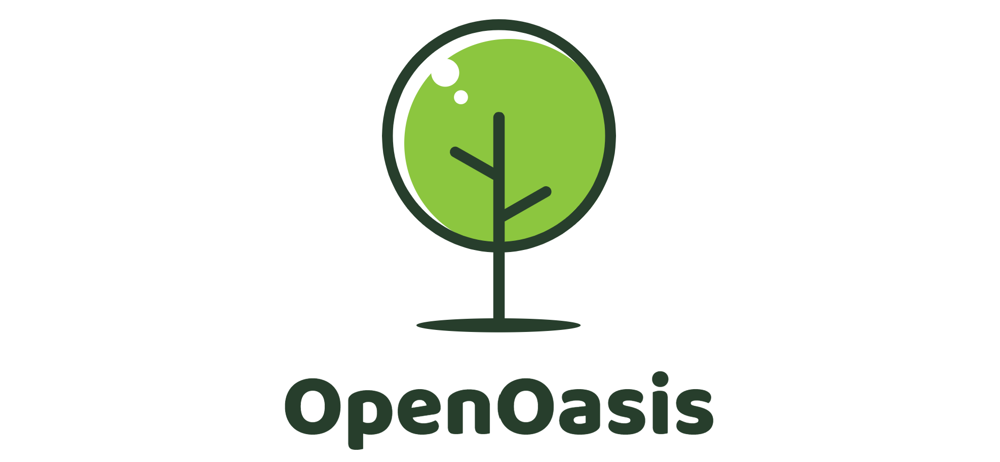

 

**OpenOasis，绿洲，一个物理世界机理模型的开放实验项目。**

---------------------------------------------------------------------------------

# 项目资源

*Resources*

本单元主要提供一些项目相关的测试算例集和徽标等资源。

---------------------------------------------------------------------------------

## 测试算例集

*Benchmarks*

模型/算法校核、评估所需的算例，包括：  

+ 第一类算例：算例是业内广泛使用的，或存在解析解的，或数据经过复现，可靠稳定。
+ 第二类算例：工程应用场景，描述了模型在现实中的使用方式和应用价值等。
+ 第三类算例：算例是为孤例，或未被业内广泛使用，使用前要仔细地评估数据合理性。

要求算例使用前仔细评估数据内在合理性、数据间匹配性及适用场景，生成算例评估报告。

---------------------------------------------------------------------------------

## 徽标

*Logo*

项目使用的标识。

---------------------------------------------------------------------------------

## 理论简介

*Theory Briefs*

相关流体力学、热力学、水力学、水文学理论以及数值计算理论简介。

### 流体力学模型

* [纳维斯托克斯模型](./TheoryBriefs/NavierStokesModel.md)
* [圣维南模型](./TheoryBriefs/SaintVenantModel.md)
* [玻尔兹曼模型](./TheoryBriefs/BoltzmannModel.md)
* [流体力学模型图谱](./TheoryBriefs/FluidFlowEquationClusters.md)
* [管网水力模型](./TheoryBriefs/PipeNetworkModel.md)

### 水文学模型

### 热力学模型

### 数值算法

* [参数敏感性分析]()
* [运动学分析方法]()
* [量纲分析和相似性原理]()

### 开发导则

* [模型开发导则]()

---------------------------------------------------------------------------------

