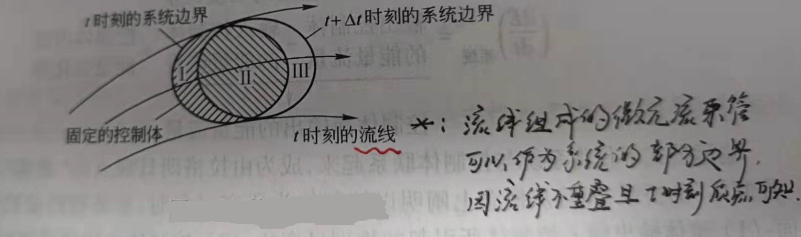

---------------------------------------------------------------------------------

# 流体力学方程图谱

*Fluid Flow Clusters*

根据流动的维度、恒定和非恒定的变化、假设和概化的方案，以及介质的尺度（宏观、微观、介观），  
描述流体的方程纷繁复杂，但又因为面对共同的对象，致之间存在各种物理、数学上的联系，  
一起构成一簇簇异彩纷呈的方程体系。

+ [圣维南方程、浅水方程和纳维-斯托克斯方程](#圣维南方程浅水方程和纳维-斯托克斯方程)；
+ [输运方程组](#输运方程组);
+ [守恒型与非守恒型格式](#)
+ [布西内斯克方程、伯格斯方程和拉普拉斯方程](#)
+ [玻尔兹曼方程、纳维-斯托克斯方程和欧拉方程](#)

---------------------------------------------------------------------------------

## 圣维南方程、浅水方程和纳维-斯托克斯方程

*Saint Venant Eq., Shallow Water Eq. And Navier Stokes Eq.*

从三维纳维斯托克斯方程出发，忽略垂直方向运动并采用静水压强假设，则可以得到二维浅水方程；  
继续，忽略横向流动并采用缓坡假设，则可以得到一维圣维南方程。

浅水方程在洋流、大气环流等领域有广泛应用，圣维南方程一般只用于明渠水力学。

*------------------ * ------------------*

在条件：1.) 密度是常数（不可压缩流体）；2.) 满足连续性方程；3.) 满足牛顿流体的本构关系 下，  
纳维-斯托克斯方程在 $x$ 方向上的标量形式：

$$\frac{\partial u}{\partial t} + u \frac{\partial u}{\partial x} + v \frac{\partial u}{\partial y} + w \frac{\partial u}{\partial z} = - \frac{\partial p}{\partial x} \frac{1}{\rho} + \nu (\frac{\partial^2 u}{\partial x^2} + \frac{\partial^2 u}{\partial y^2} + \frac{\partial^2 u}{\partial z^2}) + f_x$$

对于浅水方程，由于水深远小于其他两个维度，即考虑为二维流动、流速在垂直方向上均匀分布 。  
此时，$w, z$ 项不复存在，替代 $z$ 的参数是水深 $h$，即为：

$$\frac{\partial w}{\partial t} = \frac{\partial w}{\partial x} = \frac{\partial w}{\partial y} = \frac{\partial w}{\partial z} = 0 \quad \&\& \quad \frac{\partial u}{\partial z} = \frac{\partial v}{\partial z} = 0$$

同时，简化摩阻项，认为摩阻力是含在 $f_x, f_y$ 中，即为：

$$(\frac{\partial^2 u}{\partial x^2} + \frac{\partial^2 u}{\partial y^2}) = 0 \quad the \space effect \space are \space contained \space in \space f_{x}^{'}$$

最后，假设浅水流动中压强符合静水压强分布，则有：$\partial p = \rho g (\partial h)$。综合后，得到**浅水方程**：  

$$\begin{gathered}
\frac{\partial u}{\partial t} + u \frac{\partial u}{\partial x} + v \frac{\partial u}{\partial y}  = -g \frac{\partial h}{\partial x} + f_{x}^{'}  \\  
  \\
\frac{\partial v}{\partial t} + u \frac{\partial v}{\partial x} + v \frac{\partial v}{\partial y}  = -g \frac{\partial h}{\partial y} + f_{y}^{'} 
\end{gathered}$$

*------------------ * ------------------*

对于明渠流动，其流动是一维的、忽略横向流动，这在浅水方程中等价于：

$$\frac{\partial v}{\partial t} = \frac{\partial v}{\partial x} = \frac{\partial v}{\partial y} = 0 \quad \&\& \quad \frac{\partial u}{\partial y} = 0$$

一般地，假设 $f_x$ 中只包含重力 $f_{x,g}$ 和摩擦力 $f_{x,f}$；假设明渠为缓坡（坡角为 $\theta$，坡度为 $S$），  
总水头线与底坡不平行（摩阻坡度为 $S_f$，通常采用曼宁公式计算），则有：  

$$f_{x,g} = g sin \theta = g tan \theta = g S \quad \&\& \quad f_{x,f} = g S_f$$

考虑体积力的方向，重力沿流动方向，摩阻力逆流动方向，得到圣维南方程：  

$$\frac{\partial u}{\partial t} + u \frac{\partial u}{\partial x} + g \frac{\partial h}{\partial x} + g (S -S_f) = 0$$

其中，以上三个方程组都是流体运动的动量守恒方程，若加上各自的连续性方程，都能闭合。

[<i class="fa fa-home"></i>](#流体力学方程簇)

*--- 本章作者：---*

[1] **朗月**，“ 希望这篇文章能够为你提供帮助，如有错误望不吝指正，欢迎交流！:D ”   

*--- 参考资料：---*

[1] [匿名. Saint-Venant方程、Navier-Stokes方程、雷诺方程和浅水方程之间有哪些联系与区别？](https://www.zhihu.com/question/36902274/answer/82860354)

---------------------------------------------------------------------------------

## 输运方程组

*Transport Equations*

与研究流体质点微观运动的拉格朗日方法和欧拉方法相对应，在研究流体运动的宏观行为时也存在  
两种不同视角：  
+ 可以在流场中选定部分流体，即系统，作为研究对象；
+ 或者选择确定的流场空间，即控制体，作为研究对象；

**系统**，是由确定数量的流体质点所组成的流体团。系统在流体运动过程中，全程保持质量不变，  
体积和形状可以改变；系统与外界可以有动量或能量交换。  
**控制体**，是流场中一个固定的空间体积，控制体的边界称为控制面。控制体在流体运动过程中，  
形状和位置保持不变，控制面上可以存在质量和能量交换。

基于 “系统” 的物理量（质量、动量和能量）守恒原理转成基于 “控制体” 的表达形式，就需要考虑  
控制体的质量变化，就要建立系统物理量随时间的变化率与控制体内该物理量随时间的变化率、  
及其经过控制面的净通量间的关系，称为 **输运方程**。

在流场中取阴影部分作为控制体；将控制体所包含的流体取为要考察的系统，即控制体系统。  
在起始时刻 t，系统的边界与控制面重合，系统的体积与控制体空间重合。  
经过时间 Δt，系统的边界移动新位置，占据空间 Ⅱ 和 Ⅲ；控制体的空间依然是固定不动的。

起始时刻 t，系统质量为 $m |_{t} = m_{Ⅰ} |_{t} + m_{Ⅱ} |_{t}$；经过时间 Δt，系统质量为 
 $m |_{t + \Delta t} = m_{Ⅱ} |_{t + \Delta t} + m_{Ⅲ} |_{t + \Delta t}$。

系统的质量变化率：  
$$\begin{aligned}
(\frac{\mathrm{d} m}{\mathrm{d} t})_{system} &= \underset{\Delta t \rightarrow 0}{\mathrm{lim}} \frac{m |_{t + \Delta t} - m |_{t}}{\Delta t} \\
&= (\underset{\Delta t \rightarrow 0}{\mathrm{lim}} \frac{m_{Ⅲ} |_{t + \Delta t}}{\Delta t} - \underset{\Delta t \rightarrow 0}{\mathrm{lim}} \frac{m_{Ⅰ} |_{t + \Delta t}} {\Delta t}) + \underset{\Delta t \rightarrow 0}{\mathrm{lim}} \frac{(m_{Ⅱ} + m_{Ⅰ})|_{t + \Delta t} - (m_{Ⅱ} + m_{Ⅰ}) |_{t} }{\Delta t}
  \\
(\frac{\mathrm{d} m}{\mathrm{d} t})_{system} &= (\textbf{输出控制体的质量} - \textbf{输入控制体的质量}) + \textbf{控制体内的质量变化率} \\
&= 0
\end{aligned}$$

输运方程不仅能将系统与控制体联系起来，成为由拉格朗日观点下 “系统” 过渡到欧拉观点下  
“控制体” 的桥梁；而且，  
从概念上阐明以控制体为研究对象时，系统物理量的变化来自两个方面：  
1. 流体输出输入控制体引起的物理量变化；
2. 控制体对象内流体物理量随时间的变化。

类似地，对于控制体对象，系统的动量 P 和能量 E 的变化率表达形式都与质量具有相似的结构，  
从而可以得到：  
$$\begin{aligned}
(\frac{\mathrm{d} P}{\mathrm{d} t})_{syst} &= (\textbf{输出控制体的动量} - \textbf{输入控制体的动量}) + \textbf{控制体内的动量变化率}  \\
(\frac{\mathrm{d} E}{\mathrm{d} t})_{syst} &= (\textbf{输出控制体的能量} - \textbf{输入控制体的能量}) + \textbf{控制体内的能量变化率}
\end{aligned}$$

[<i class="fa fa-home"></i>](#流体力学方程簇)

*--- 本章作者：---*

[1] **朗月**，“ 希望这篇文章能够为你提供帮助，如有错误望不吝指正，欢迎交流！:D ”  

---------------------------------------------------------------------------------