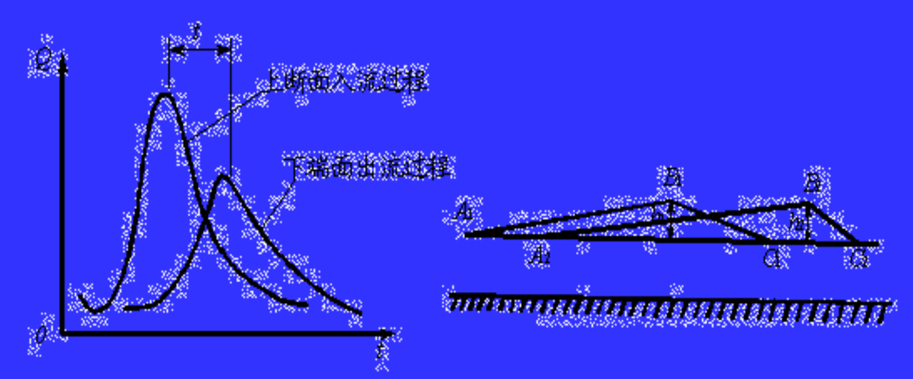
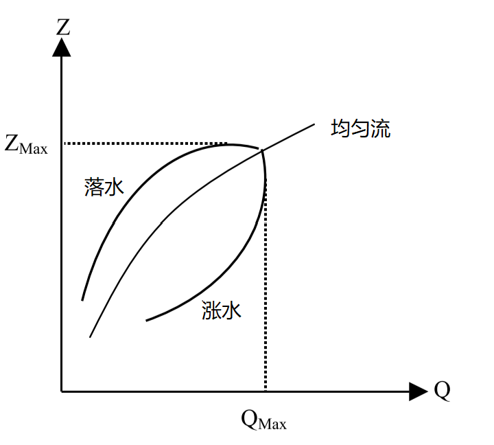

 

---------------------------------------------------------------------------------

# 圣维南模型拓展

*Saint-Venant Model More*  

本篇主要是继续介绍在圣维南模型框架下的流体力学现象和理论。

+ [动力波和运动波、扩散波、惯性波](#动力波和运动波扩散波惯性波);

---------------------------------------------------------------------------------

## 动力波和运动波、扩散波、惯性波

*Dynamic Wave & Kinematic Wave、Diffusion Wave、Inertial Wave*

明渠洪水波的运动特征：
1. **相位**，洪水波轮廓线上任一点的位置；**波速**，洪水波体上某一相位点沿程运动速度，$C_k = \frac{\mathrm{d}s}{\mathrm{d}t}$；
2. **相应流量**，洪水波体上某相位点对应的断面流量；**相应水位**，波体上某相位点对应的断面水位 ；
3. **附加比降**，洪水波的水面比降与恒定流时的水面比降的差值。

一般的，洪水波波前水面比恒定流更陡，故波前附加比降为正；而洪水波波后水面较平缓，  
故波后附加比降为负。

由于洪水波波前水面比降大于恒定流、波后水面比降小于恒定流，  
所以波前各相位点的波速大于波后，从而导致洪水波波体拉长，波长变大、波峰变小，  
称为 **洪水波的坦化变形**。  
由于洪水波各相位点的波高不同、水深不同，从而导致波速不同；  
波峰处流速最大。因此在洪水波传播中，波峰不断前移，波前缩短、附加比降增大，  
波前流量不断向波后转移，称为 **洪水波的扭曲变形**。

一般的，当明渠来流大于断面水位在恒定流下过流能力时，则水位上涨、蓄量增加，  
所经历的时间称为涨洪历时。  
洪水波从明渠上游传到下游，  
由于坦化变形，波峰降低、波长拉长；又由于扭曲变形，波前缩短、涨水历时缩短。  
洪水波的坦化和扭曲变形是洪水波传播中内因造成的，  
但区间内水量的变化、断面的变化等外因会影响结果。
 
洪水波根据主导影响因素，可以分为：动力波、惯性波、扩散波、运动波。
$$
\textbf{动力波}，i - \frac{\partial h}{\partial s} = \frac{\partial h_f}{\partial s} + \frac{1}{g} \frac{\partial v}{\partial t} + \frac{v}{g}\frac{\partial v}{\partial s}  \\
\textbf{运动波方程}，i = \frac{\partial h_f}{\partial s}； \\ \textbf{扩散波方程}，i - \frac{\partial h}{\partial s} = \frac{\partial h_f}{\partial s}；\\ \textbf{惯性波方程}，i - \frac{\partial h}{\partial s} = \frac{1}{g} \frac{\partial v}{\partial t} + \frac{v}{g}\frac{\partial v}{\partial s}
$$

*------------------ * ------------------*

**运动波** 只考虑摩阻和底坡的主导作用，忽略运动方程中的惯性项和压力项。  
采用恒定均匀流计算摩阻坡度  
$$i = \frac{\partial h_f}{\partial s} = J_f = \frac{Q^2}{K^2} = \frac{v^2}{C^2 R} \quad \Rightarrow Q = K \sqrt{i}$$

因流量模数 K 是断面形状和水深的函数；故对于固定断面而言，流量与水位呈单值关系   
Q = f(Z) 或 Q = f(A)；  
因水位流量呈单一关系，断面最大流量、断面最高水位、沿程最大流量和沿程最大水深  
重合在同一个断面；
$$\frac{\partial A}{\partial t} = \frac{\partial A}{\partial Q} \frac{\partial Q}{\partial t} \quad \Rightarrow \frac{\partial Q}{\partial A} = C_k = v + A \frac{\partial v}{\partial A} = v \eta, \quad \textbf{波速系数} \eta = (1 + \frac{A}{v} \frac{\partial v}{\partial A})$$

代入不可压缩非恒定流连续性方程，可以得到 **对流方程**：  
$$\frac{\partial Q}{\partial t} + C_k \frac{\partial Q}{\partial s} = 0$$

特征线方程及方程解：  
$$\textbf{特征线}，\frac{\mathrm{d} s}{\mathrm{d} t} = C_k; \quad \textbf{特征关系}，\frac{\mathrm{d} Q}{\mathrm{d} t} = 0$$

由特征线方程可知，  
运动波只有顺特征线、没有逆特征线（下游无法影响上游），运动波只能向下游传播 。  
又由特征关系可知，  
运动波沿特征线传播时，任何点的相应流量都不发生变化，即运动波不发生坦化变形 。

山区河流由于底坡较大，其洪水波接近运动波；同时因摩阻坡度非负，  
所以运动波方程只适用于**顺坡流动** 。

根据波速 Ck 的性质，可以判断运动波是否发生扭曲变形：  
1. 若 $C_k$ 为常数，则运动波上每一相应流量和水位都以相同速度向下游传播，且没有扭曲变形；
2. 若 $C_k$ 为流量或水深的函数，运动波扭曲，但波峰不变、无耗散；至波前垂直，为运动激波；
3. 一般情况下，流速随水深而增加，故运动波一般具有扭曲变形；
4. 波速系数一般大于 0，波速要大于断面流速。

*------------------ * ------------------*

**扩散波** 忽略了惯性项，但是保留压力项（由此水面线与底坡不再平行）。  
采用恒定均匀流计算摩阻坡度  
$$\begin{gathered}
i - \frac{\partial h}{\partial s} = \frac{\partial h_f}{\partial s} \quad \Rightarrow Q = K \sqrt{i} \cdot \sqrt{1 - \frac{1}{i} \frac{\partial h}{\partial s}} = Q_0 \sqrt{1 - \frac{1}{i} \frac{\partial h}{\partial s}}  \\
Q_0, \quad 恒定均匀流下流量
\end{gathered}$$

对于某一固定断面，涨洪时 $\frac{\partial h}{\partial s} < 0$，故流量Q > Q0；落洪时 $\frac{\partial h}{\partial s} > 0$，故流量Q < Q0。  
所以，扩散波运动中断面水位与流量呈现**逆时针**的绳套曲线关系。在一场洪水波过程中，  
断面流量首先达到最大值，之后水位达到最大值。

对于宽浅矩形棱柱形明渠，宽度为B，近似存在 $ R \approx h, A = B h$；若不考虑旁侧入流：  
$$\begin{cases}
\frac{\partial h}{\partial s} = i -  \frac{Q^2}{A^2 C^2 R}  \qquad \Rightarrow \frac{\partial^2 h}{\partial s \partial t} = \frac{2Q}{C^2 B^2 h^3} \frac{\partial Q}{\partial t} + \frac{3 Q^2}{C^2 B^2 h^4} \frac{\partial h}{\partial t}  \\
  \\
B \frac{\partial h}{\partial t} + \frac{\partial Q}{\partial t} = 0 \qquad \Rightarrow \frac{\partial h}{\partial t} = -\frac{1}{B} \frac{\partial Q}{\partial s} \quad \Rightarrow \frac{\partial^2 h}{\partial t \partial s} = -\frac{1}{B} \frac{\partial^2 Q}{\partial s^2}
\end{cases}$$

综合，得到：  
$$\frac{\partial Q}{\partial t} + (\frac{3}{2} \frac{Q}{B h})\frac{\partial Q}{\partial s} = (\frac{C^2 B^2 h^3}{2 Q}) \frac{\partial^2 Q}{\partial s^2}$$

令：  
$$\textbf{波速} \quad C_k = \frac{3}{2} \frac{Q}{B h} = 1.5 v \approx 1.5 v_0; \quad \textbf{扩散系数} \quad D = \frac{C^2 B^2 h^3}{2 Q} = \frac{Q}{2 B J_f} \approx \frac{Q_0}{2 B i}$$

得到 **对流扩散方程**：  
$$\frac{\partial Q}{\partial t} + C_k \frac{\partial Q}{\partial s} = D \frac{\partial^2 Q}{\partial s^2}$$

特征线及特征关系：  
$$\textbf{特征线}，\frac{\mathrm{d} s}{\mathrm{d} t} = C_k; \quad \textbf{特征关系}，\frac{\mathrm{d} Q}{\mathrm{d} t} = D \frac{\partial^2 Q}{\partial s^2}$$

由特征线方程可知，扩散波只有顺特征线 （下游无法影响上游），其只能以波速 Ck 向下游传播。  
由特征关系可知，扩散波沿特征线传播时相应流量会发生变化，会发生波峰变形；**运动波是特例**。

*------------------ * ------------------*

**惯性波** 只考虑惯性力的主导作用，保留压力项、忽略运动方程中摩阻项。  
$$\frac{\partial h}{\partial s} + \frac{1}{g} \frac{\partial v}{\partial t} + \frac{v}{g}\frac{\partial v}{\partial s} = i$$

明渠中波的相对传播速度：$v_w = \sqrt{gh}$；联立连续性方程，各项乘以 g；  
方程组分别相加、相减，得到：    
$$\begin{cases}
\frac{\partial }{\partial t} (v + 2 v_w) + (v + v_w) \frac{\partial }{\partial s}(v + 2 v_w) = gi  \\
  \\
\frac{\partial }{\partial t} (v - 2 v_w) + (v - v_w) \frac{\partial }{\partial s}(v - 2 v_w) = gi
\end{cases}$$

令：  
$$\psi = v \pm 2v_w; \qquad f = v \pm v_w; \qquad \eta = gi$$

由此，原方程组合成得到：  
$$\frac{\partial \psi}{\partial t} + f \frac{\partial \psi}{\partial s} = \eta$$

由此可得到该拟线性方程的**特征方程组**，包括   
两个**特征方向方程** $\frac{\mathrm{d} s}{\mathrm{d} t} = f$，  
两个**特征微分关系** $\frac{\mathrm{d} \psi}{\mathrm{d} t} = \eta$。

将特征方程展开，可得到：  
$$\begin{cases}
\textbf{顺特征方向}：\frac{\mathrm{d} s}{\mathrm{d} t} = v + \sqrt{gh}, \quad \frac{\mathrm{d} (v + 2 \sqrt{gh})}{\mathrm{d} t} = g i  \\
  \\
\textbf{逆特征方向}：\frac{\mathrm{d} s}{\mathrm{d} t} = v - \sqrt{gh}, \quad \frac{\mathrm{d} (v - 2 \sqrt{gh})}{\mathrm{d} t} = g i  \\
\end{cases}$$

可知，矩形明渠水流有两簇不同的实特征线；顺、逆特征方向存在非恒定流顺波和逆波的绝对速度。  
明渠水流中，弗劳德数 $F_r = \frac{v}{\sqrt{gh}} = \frac{v}{v_w}$ 。  

当 Fr < 1 时，水流为缓流，微波不会向上游传播、只影响下游；$v < \sqrt{gh}$，  
逆特征方向$\frac{\mathrm{d} s}{\mathrm{d} t} < 0$，印证。  
当 Fr > 1 时，水流为急流，微波可以向上游传播、能影响下游；$v > \sqrt{gh}$，  
逆特征方向$\frac{\mathrm{d} s}{\mathrm{d} t} > 0$，印证。

惯性波无摩阻项，故无能量损失；惯性波传播中，只有能量转换（流速和水深），为周期性振荡波。  
惯性波中惯性力起主导作用，摩阻和底坡影响小（可忽略）；入库洪水波、闸启闭的波动近似如此。

[<i class="fa fa-home"></i>](#流体力学方程簇)

*--- 本章作者：---*

[1] **朗月**，“ 希望这篇文章能够为你提供帮助，如有错误望不吝指正，欢迎交流！:D ”  

---------------------------------------------------------------------------------